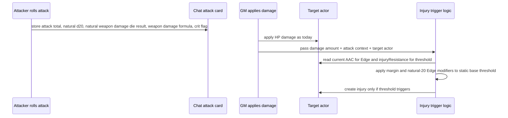

# Add Injury Thresholds to Legacy WWN

**Target source repo:** `wwn`

## Overview

Implement the attack-damage injury threshold system in the Worlds Without Number Foundry system. The source checkout is `wwn`; the installed Foundry runtime copy is a separate release package under Foundry's `Data/systems/wwn` directory. The source checkout has been updated from `SobranDM/foundryvtt-wwn` to system version 1.7.0, while the installed runtime copy is still the Store/downloaded version 1.6.1. The source checkout is canonical for implementation; Foundry must be pointed at that checkout, or refreshed from it, before runtime QA is meaningful.

The intended rule is: damage from attack rolls can trigger an injury when the natural weapon damage die meets or exceeds a defender-specific injury number. The injury number starts from a static base and is modified by an explicit actor `injuryResistance` stat, while attack margin against final AC supplies the `+5/+10` Edge modifier. AC affects whether the attack hits and whether it earns Edge; it does not directly set the defender's injury threshold.

---

## Problem Frame

The current legacy WWN injury path is too late and too severe: injuries mainly happen when damage pushes a character below 0 HP, using a Goblin Punch-style severity roll that can create brutal outcomes and long post-0 fights. The new system should make injuries possible earlier, more narratively varied, and more strategically gritty without making death much more common.

Foundry implementation should minimize item administration. The system should expose a visible `injuryResistance` stat on character and monster sheets so the GM can manually encode protection during playtesting instead of requiring armor item reclassification or brittle inference from AC fields.

---

## Requirements Trace

### Rule Behavior

- R1. Injury threshold must use a static base plus an explicit actor `injuryResistance` stat, not derived AC.
- R2. Attack margin must modify injury chance: hit by 5+ lowers the injury number by 1; hit by 10+ lowers it by 2.
- R3. Natural 20s must apply the best attack-margin Edge modifier for threshold checks, but must not automatically create an injury or bypass the natural damage die threshold.
- R4. Damage without an attack roll, including shock, environmental damage, manual damage, and healing, must not accidentally receive attack-margin Edge.
- R5. Existing wound and injury counters should be reused where practical.

### Backward Compatibility

- R6. The implementation must preserve existing damage application behavior when the new injury threshold setting is disabled.

### Source/Runtime Operations

- R7. The plan must account for the source/runtime mismatch between the git checkout and installed Foundry system.
- R8. The implementation plan must preserve the source-to-runtime build loop: Node 20+ install, CSS build, test run, and explicit Foundry system sync.

---

## Scope Boundaries

- Do not redesign the full WFRP/Goblin Punch injury result table in this implementation pass.
- Do not require manual recategorization of all armor items.
- Do not change normal attack hit/miss rules.
- Do not change HP loss, healing, shock, or wound point behavior except where injury trigger metadata is passed alongside damage.
- Do not let shock damage trigger threshold injuries. If shock reduces a target below 0 HP, the existing below-zero wound/injury rules still apply.
- Do not add a below-half-HP modifier to threshold injury frequency in this pass. Health level may affect threshold injury severity instead.
- Do not infer `injuryResistance` automatically from armor items in this pass. The GM will manually set the value for armor, shields, monster natural armor, and other protection.
- Do not implement the SWNR version in this plan.

### Deferred to Follow-Up Work

- Rich attack-tag injury nature tables: keep the first implementation focused on trigger math, a light severity roll, and a small set of threshold-specific minor/moderate descriptions.
- A full Foundry settings UI for every tuning constant: start with a small number of world settings and constants.
- Backporting changes into the installed v1.6.1 system package. The updated 1.7.0 source checkout is the implementation target.

---

## Context & Research

### Relevant Code and Patterns

- `system.json`: source checkout is now version 1.7.0, Foundry v13-compatible, and declares `wwn.js` plus `tests/quench/register.js` as ES modules.
- `package.json`: source checkout now has a Node toolchain with `npm test`, `npm run build:css`, and `npm run watch:css`; Tailwind 4 requires Node 20+.
- `styles/main.css`: generated CSS artifact consumed by Foundry. Foundry does not build this file at runtime.
- `wwn.js`: runtime entrypoint loaded directly by Foundry. There is no JavaScript bundling step.
- `module/actor/entity.js`: applies HP loss in `applyDamage`, delegates actor-specific behavior to type modules, and remains the right integration point for damage-time injury routing.
- `module/actor/types/character.mjs`: contains the current `applyWounds` injury path and crit resistance adjustment.
- `module/dice.js`: builds attack roll chat output in `sendAttackRoll` and computes success against target AAC in `digestAttackResult`.
- `module/chat.js`: provides shared chat damage application helpers and context-menu damage handling.
- `module/item/chat-cards.mjs`: handles attack-card button clicks such as `data-action="apply-damage"` and routes those clicks into `applyChatCardDamage`.
- `templates/chat/roll-attack.hbs`: displays attack, damage, target, and shock output.
- `module/data/actor/character.mjs`: the current Foundry v13 character TypeDataModel defines `system.hp.injuries` and `system.hp.wounds`.
- `module/data/actor/monster.mjs`: the current Foundry v13 monster TypeDataModel defines HP `hd`, `value`, and `max`, but does not currently define `system.hp.injuries` or `system.hp.wounds`.
- `template.json`: useful as legacy data-shape reference, but TypeDataModels are authoritative for runtime actor schemas in the current v13 source.
- `module/settings.js`: existing world settings include wound-related behavior such as `replaceStrainWithWounds` and local wound-point toggles.
- `tests/node/*.spec.js`: upstream now provides a Node/Mocha test harness for pure module behavior.
- `macros/apply-wounds.js` and `macros/critical-hit.js`: untracked local macro experiments that may contain useful injury presentation ideas but should not be treated as canonical source until reviewed.

### Institutional Learnings

- No `docs/solutions/` entries were found in the Obsidian vault during this planning pass.

### External References

- No external framework research is needed for the implementation mechanics. The probability target is informed by common RPG injury-system patterns: lasting injuries are usually reserved for critical hits, reaching 0 HP, massive damage, or failed post-hit checks. Because this feature allows injuries before 0 HP, the trigger should be moderately frequent only when the severity table stays mostly minor/moderate.

---

## Key Technical Decisions

- Implement in the git checkout, not directly in the installed release copy: the checkout has source control, local homebrew history, current upstream architecture, and tests; the Foundry Data copy is a release artifact/runtime target.
- Use the updated 1.7.0 source checkout as canonical. Do not port new work into the installed v1.6.1 package.
- Treat the runtime sync as a required implementation step: after code and CSS build, either symlink the source checkout into Foundry's `Data/systems/wwn` path or copy a built checkout into that directory.
- Keep Node 20+ as an environment prerequisite. Tailwind 4's native build dependency fails under Node 18.
- Put trigger math in small helper functions near actor damage/injury behavior and cover those helpers with the existing Mocha test harness.
- Store authoritative attack context on the chat message at attack-roll creation time: damage application later needs attack total, natural d20, and the natural weapon damage die result to compute margin, crit behavior, and threshold eligibility.
- Treat rendered chat-card data attributes as presentation/debugging only, not as authoritative injury-trigger state.
- Compute Edge at damage-application time per selected recipient: selected tokens are authoritative for damage application, and each recipient compares the stored attack total against its current AAC independently.
- Natural 20s apply the best Edge modifier, equivalent to hit-by-10+ / `-2` Injury Number. They do not automatically injure and do not bypass the natural damage die threshold.
- Health level affects threshold injury severity, not threshold injury frequency.
- Use a static base Injury Number of `6+`, modified by explicit actor `injuryResistance` and Edge: `clamp(6 + injuryResistance - edge, 4, 9)`.
- Add `injuryResistance` to character and monster actor data and display it on their sheets. Default it to `0`; expected manual playtest values are `0` for no/light protection, `1` for medium armor or modest natural armor, `2` for heavy armor or strong natural armor, and `3` only for rare exceptional protection.
- Do not derive injury threshold directly from AAC, Dex, generic AC modifiers, ActiveEffects, or Charge-like transient states. AAC remains relevant only for attack hit/miss and damage-time Edge.
- Do not apply threshold injuries to shock damage: shock is not a landed hit and should not inherit attack-margin Edge. Shock that drops a target below 0 HP still follows the existing below-zero wound/injury path.
- Show injury/wound counters on actor sheets when either `replaceStrainWithWounds` or the new `thresholdInjuries` setting is enabled.
- Use a light threshold severity roll instead of the existing below-zero wound formula. The exact constants can be tuned, but the intended shape is smaller than `1d12 + excess + current injuries`; health level may modify severity.
- Do not add a post-trigger save in this pass. If threshold injuries prove too frequent or too punishing, add a save-to-reduce-severity as a later tuning lever rather than blocking the first implementation.
- Use weapon die size as severity pressure after the threshold triggers: `d4/d6` lighter, `d8` normal, and `d10/d12` heavier.
- Include minimal threshold-injury narrative variety in this pass: use hit location and a small set of gentler minor/moderate threshold effects, while leaving full attack-tag injury nature tables for follow-up.

---

## Open Questions

### Resolved During Planning

- Is there source code in the installed legacy WWN system directory? Yes. The installed system contains readable module files under `module/`, templates, and JSON data, but it is not a git checkout.
- Is there source elsewhere on the machine? Yes. A git checkout exists at `wwn`, with remote `https://github.com/bunnysage/foundryvtt-wwn.git`.
- Does the source checkout match the installed Foundry system? No. The checkout has now been merged up to upstream version 1.7.0; the installed system remains version 1.6.1. Key files and build expectations differ.
- How is the system built? Foundry loads JavaScript modules directly from `system.json`; only CSS is built, via `npm run build:css`, and the result is committed as `styles/main.css`.
- Which Node version is required? Use Node 20+ for install/build. Node 18 fails the Tailwind 4 native dependency used by the upstream CSS build.

### Deferred to Implementation

- Exact installation strategy for testing: prefer a symlink from Foundry's `Data/systems/wwn` to the built source checkout for iteration, but a copied checkout is acceptable for package-style testing.
- GitHub push strategy: local merge to upstream 1.7.0 is complete, but pushing to `origin` currently requires credentials that can write to the `bunnysage/foundryvtt-wwn` fork.
- Exact release packaging strategy: if changes are distributed beyond local use, decide whether to publish a fork release zip or keep the local symlink/copy workflow.

### Resolved During Review

- Split settings work: introduce the core `thresholdInjuries` opt-in setting before damage routing, then handle tuning/localization later.
- Keep below-half-HP out of threshold trigger frequency. Health level may affect severity instead.
- Shock never causes threshold injuries. Shock that drops a target below 0 HP follows existing below-zero rules.
- Show injury/wound counters when either `replaceStrainWithWounds` or `thresholdInjuries` is enabled.
- Natural 20s apply best Edge only; they do not automatically injure or bypass the natural damage die threshold.
- Use a light severity roll for threshold injuries rather than the existing below-zero wound formula.
- Add probability tables and manual QA gates for common weapon dice against base `6+`, `injuryResistance` 0-2, normal Edge, natural-20/best Edge, and severity-pressure outcomes.
- Include minimal threshold-specific narrative variety in this pass; defer full attack-tag injury nature tables.
- Use damage-time AAC for each selected recipient when computing Edge. Selected recipients at damage application time are threshold-eligible if the source chat card is a valid normal attack.
- Positive attack-damage multiplier buttons remain threshold-eligible. The multiplier affects HP damage only; threshold eligibility and the natural damage die result stay unchanged.
- Invalid attack context applies HP damage normally, skips threshold injury logic, and emits a GM-only skipped-threshold note with the skip reason.
- Replace the old AC-derived protection formula with explicit `injuryResistance`. AC no longer directly changes threshold triggering; it only changes hit chance and Edge. Add the stat to character and monster sheets so the GM can manually model medium/heavy armor, shields, natural armor, or unusual protection.

---

## High-Level Technical Design

> *This illustrates the intended approach and is directional guidance for review, not implementation specification. The implementing agent should treat it as context, not code to reproduce.*

Decision matrix:

| Damage source | Attack context? | Injury threshold? | Edge? |
|---|---:|---:|---:|
| Normal attack damage | Yes | Yes | Yes, by attack total vs selected recipient's current AAC |
| Half normal attack damage | Yes | Yes; multiplier affects HP only | Yes, by attack total vs selected recipient's current AAC |
| Double normal attack damage | Yes | Yes; multiplier affects HP only | Yes, by attack total vs selected recipient's current AAC |
| Natural 20 attack damage | Yes | Yes, if natural damage die meets threshold after best Edge | Yes, best Edge |
| Shock damage | Partial/no | No; existing below-zero rules still apply if HP drops below 0 | No |
| Manual context-menu damage | No | No by default | No |
| Falling/environment/spell damage | No unless explicitly supplied | Future/manual | No |
| Healing | No | No | No |

---

## Implementation Units

- U1. **Establish Source, Build, and Runtime Loop**

**Goal:** Make the implementation path explicit: edit source, run Node checks, build CSS, then load the built source in Foundry.

**Requirements:** R7, R8

**Dependencies:** None

**Files:**
- Modify: `README.md` or a short local implementation note if the repo uses one
- Reference: `package.json`
- Reference: `system.json`
- Test: `tests/node/*.spec.js`

**Approach:**
- Treat `wwn` as the canonical source repo because it has git history, the upstream 1.7.0 merge, local homebrew commits, and tests.
- Record that the installed Foundry Data copy is a separate v1.6.1 runtime package and should not be edited as source.
- Use Node 20+ for dependency install and CSS build.
- Run `npm test` for module-level checks.
- Run `npm run build:css` after CSS-affecting changes or after dependency refresh.
- For Foundry QA, replace the installed system folder with either a symlink to the source checkout or a copied built checkout. Prefer a symlink for local iteration, with the original installed folder moved aside first.

**Execution note:** Characterization-first. Do not modify both source and installed runtime copies in parallel. The installed copy is a runtime target only.

**Patterns to follow:**
- Existing repo source layout under `module/`, `templates/`, `lang/`, and `template.json`.

**Test scenarios:**
- Build path: Node 20+ can install dependencies without Tailwind native binding failures.
- Build path: `npm test` passes before injury behavior work begins.
- Build path: `npm run build:css` produces `styles/main.css`.
- Runtime path: Foundry loads the same source tree that was tested and built.

**Verification:**
- The implementer can state which directory is canonical source, which Node version is required, which files Foundry loads directly, and which directory Foundry will load for testing.

---

- U2. **Add Pure Injury Threshold Helpers**

**Goal:** Isolate the rule math for injury resistance, injury number, margin Edge, and threshold triggering.

**Requirements:** R1, R2, R3, R4, R6

**Dependencies:** U1

**Files:**
- Create or modify: `module/injury-thresholds.mjs`
- Modify: `wwn.js` if the new module needs to be imported/exported
- Test: `tests/node/injury-thresholds.spec.js`

**Approach:**
- Add helper logic for:
  - Actor `injuryResistance` lookup with a default of `0`.
  - Injury number as `clamp(6 + injuryResistance - edge, 4, 9)`.
  - Edge modifier from `attackTotal - target.system.aac.value`.
  - Natural 20 best-Edge modifier, equivalent to hit-by-10+.
  - Health-level severity modifier, without changing injury trigger frequency.
- Keep helpers independent of DOM/chat so they can be tested without Foundry rendering.

**Patterns to follow:**
- Existing actor data access in `module/actor/entity.js`.
- Existing AAC access for hit-margin Edge only; do not reuse AAC to derive base injury threshold.

**Probability targets:**

The trigger check still uses the natural weapon damage die. Severity pressure does not change these trigger odds; it changes how bad the injury is after the threshold is met.

`injuryResistance` 0, using final Injury Numbers 6+/5+/4+:

| Die | No Edge | Hit by 5 Edge | Hit by 10 / natural 20 Edge |
|---|---:|---:|---:|
| d4 | 0% | 0% | 25% |
| d6 | 17% | 33% | 50% |
| d8 | 38% | 50% | 63% |
| d10 | 50% | 60% | 70% |
| d12 | 58% | 67% | 75% |

`injuryResistance` 1, using final Injury Numbers 7+/6+/5+:

| Die | No Edge | Hit by 5 Edge | Hit by 10 / natural 20 Edge |
|---|---:|---:|---:|
| d4 | 0% | 0% | 0% |
| d6 | 0% | 17% | 33% |
| d8 | 25% | 38% | 50% |
| d10 | 40% | 50% | 60% |
| d12 | 50% | 58% | 67% |

`injuryResistance` 2, using final Injury Numbers 8+/7+/6+:

| Die | No Edge | Hit by 5 Edge | Hit by 10 / natural 20 Edge |
|---|---:|---:|---:|
| d4 | 0% | 0% | 0% |
| d6 | 0% | 0% | 17% |
| d8 | 13% | 25% | 38% |
| d10 | 30% | 40% | 50% |
| d12 | 42% | 50% | 58% |

These probabilities assume threshold injuries are usually minor/moderate. If playtesting makes injuries feel too frequent, tune severity first; only raise the base threshold if minor/moderate outcomes still feel too intrusive.

**Test scenarios:**
- Happy path: actor with missing or zero `injuryResistance` uses base injury number 6+.
- Happy path: actor with `injuryResistance` 1 uses base injury number 7+ before Edge.
- Happy path: actor with `injuryResistance` 2 uses base injury number 8+ before Edge.
- Happy path: attack total 21 against AAC 16 yields margin 5 and Edge -1.
- Edge case: attack total 26 against AAC 16 yields margin 10 and Edge -2.
- Edge case: natural 20 applies best Edge even when margin is lower than 10.
- Edge case: final injury number clamps to minimum 4+ after best Edge.
- Edge case: final injury number clamps to maximum 9+ with high `injuryResistance`.
- Edge case: character and monster actors both read `injuryResistance` without throwing.
- Error path: missing actor AAC data prevents margin Edge but does not prevent the base `injuryResistance` threshold check.

**Verification:**
- The injury math can be exercised with `npm test` without rolling or rendering a chat card.

---

- U3. **Capture Attack Context on Attack Chat Messages**

**Goal:** Preserve enough attack-roll information for later damage application to compute crits and hit-margin Edge.

**Requirements:** R2, R3, R4

**Dependencies:** U2

**Files:**
- Modify: `module/dice.js`
- Modify: `module/item/chat-cards.mjs`
- Modify: `templates/chat/roll-attack.hbs`
- Test: `tests/node/attack-context.spec.js` if the attack context can be isolated from Foundry globals

**Approach:**
- In `sendAttackRoll`, capture attack total, natural d20 result, success state, target name/id where available, weapon damage formula, final damage total, and the natural weapon damage die result needed for threshold comparison.
- For multi-die or bonus-die damage, explicitly store which die result is the threshold die and keep it distinct from modifiers, shock, trauma, healing inversion, and final damage total.
- Store authoritative context in system-created chat message flags or trusted Roll data. Do not treat rendered DOM data attributes as authoritative for natural 20, attack margin, target context, source type, or threshold die results.
- Make the context available to the `module/item/chat-cards.mjs` attack-card damage button handler, then pass eligible normal-attack context through `module/chat.js` into actor damage handling.
- On damage application, verify message/roll provenance, source type, target eligibility, and actor/item ownership before threshold injury logic can use stored attack context.

**Patterns to follow:**
- Existing `digestAttackResult` already compares roll total against target AAC.
- Existing `rollTitle` / `dmgTitle` template data already carries explanatory roll metadata.

**Test scenarios:**
- Happy path: successful attack card contains attack total, natural d20, natural weapon damage die result, final damage total, and target identity/provenance where available; recipient AAC for Edge is read at damage-application time.
- Happy path: natural 20 card marks critical context even if total math is otherwise ordinary.
- Edge case: untargeted attack card stores attack total but no fixed target margin.
- Edge case: missed attack does not expose an injury-applying normal damage path.
- Edge case: total damage meets the threshold but the natural weapon die does not, so no threshold injury triggers.
- Edge case: natural weapon die meets the threshold even when modifiers make the final damage total lower or higher.
- Edge case: malformed, stale, DOM-tampered, or non-system-created context is rejected for threshold injury logic while ordinary HP damage still follows the existing path.
- Integration: attack-card damage buttons in `module/item/chat-cards.mjs` can retrieve trusted attack context after chat render without scraping rendered dice HTML.

**Verification:**
- Applying damage from an attack card can access attack total, natural d20, and the natural weapon damage die result without reparsing rendered dice HTML.

---

- U4. **Route Damage Application Through Threshold Injury Logic**

**Goal:** Modify damage application so normal attack damage can create threshold injuries while preserving existing HP updates.

**Requirements:** R1, R2, R3, R4, R5, R6

**Dependencies:** U2, U3

**Files:**
- Modify: `module/item/chat-cards.mjs`
- Modify: `module/chat.js`
- Modify: `module/actor/entity.js`
- Test: `tests/node/damage-threshold-integration.spec.js` for pure routing helpers, plus manual Foundry QA for document updates

**Approach:**
- Extend the `module/item/chat-cards.mjs` `apply-damage` branch so normal attack damage can read trusted attack context from chat message flags or Roll data and pass it to `applyChatCardDamage`.
- Keep shock, healing, trauma, half-healing, and context-menu damage out of threshold context unless a later scoped rule explicitly makes them eligible.
- Extend `applyChatCardDamage` so it passes optional validated injury context to `actor.applyDamage`.
- Extend `applyDamage` to accept optional context without changing current callers.
- When the new setting is disabled, preserve current behavior exactly.
- When enabled and context represents normal attack damage, compute target-specific threshold for each selected recipient at damage-application time, using that recipient's current AAC for Edge and current `injuryResistance` for threshold protection.
- For positive attack-damage multiplier buttons such as 1/2 and x2, keep threshold eligibility and the natural damage die result unchanged; apply the multiplier only to HP damage.
- If threshold triggers, call a new threshold injury method rather than the current below-zero-only `applyWounds` path.
- Require threshold injury creation to run only for a user who can update the target actor, or through an explicit GM-mediated workflow if the existing damage-button path does not guarantee that permission boundary.
- Ensure healing, half-healing, shock damage, and context-menu damage do not accidentally receive attack Edge. Shock remains non-threshold, but if it reduces HP below 0 the existing below-zero wound/injury behavior still applies.

**Patterns to follow:**
- Existing attack-card action routing in `module/item/chat-cards.mjs`.
- Existing `applyDamage(amount, multiplier)` signature and caller flow in `module/chat.js`.
- Existing wound counter updates in `applyWounds`.

**Test scenarios:**
- Happy path: attack damage with weapon die meeting final injury number creates one injury and preserves HP damage.
- Happy path: same attack applied to two controlled targets uses each target's own AAC for Edge and `injuryResistance` for threshold protection.
- Happy path: hit by 5 lowers injury number by 1 for that target.
- Happy path: hit by 10 lowers injury number by 2 for that target.
- Edge case: natural 20 applies hit-by-10+ Edge without automatically creating an injury.
- Edge case: 1/2 and x2 positive attack-damage buttons keep the same threshold eligibility and natural damage die result while changing only HP damage.
- Edge case: shock button applies HP damage but no threshold injury.
- Edge case: shock damage that drops a target below 0 HP still follows existing below-zero wound/injury behavior.
- Edge case: context-menu damage applies HP damage but no threshold injury.
- Error path: malformed or missing attack context applies damage but skips threshold injury with no hard failure.
- Error path: failed provenance, source-type, target-eligibility, actor/item-ownership, or permission checks skip threshold injury with no hard failure.
- Authorization: a non-GM or otherwise unauthorized user cannot create persistent threshold injury state unless the workflow routes through an authorized GM update path.
- Regression: with the setting disabled, below-zero wounds still behave as they did before this change.

**Verification:**
- Existing damage buttons still reduce HP correctly.
- Threshold injuries occur only for intended attack damage sources.

---

- U5. **Implement Gentler Threshold Injury Creation**

**Goal:** Create injury output for threshold-triggered injuries without reusing the most severe below-zero wound behavior unchanged.

**Requirements:** R3, R5, R6

**Dependencies:** U4

**Files:**
- Modify: `module/actor/entity.js`
- Modify: `module/actor/types/character.mjs`
- Modify: `module/data/actor/character.mjs`
- Modify: `module/data/actor/monster.mjs`
- Modify: character and monster sheet code/templates needed to display `injuryResistance`
- Modify: `templates/chat/apply-damage.hbs` or create a focused injury chat template if warranted
- Test: `tests/node/threshold-injury-creation.spec.js` for pure severity/description helpers, plus manual Foundry QA for chat output

**Approach:**
- Add `injuryResistance` to character and monster TypeDataModels with a numeric default of `0`.
- Display `injuryResistance` on character and monster sheets near injury/wound or defense data so it is visible during playtesting.
- Do not auto-populate `injuryResistance` from armor items, AAC, Dex, ActiveEffects, or monster stat blocks in this pass.
- Add a method for threshold injuries that increments injury counters and creates a chat result.
- Treat Foundry v13 TypeDataModels as the runtime schema source. Character actors already define injury and wound counters; monster actors must either gain matching `system.hp.injuries` and `system.hp.wounds` fields in `module/data/actor/monster.mjs`, or threshold injuries must be explicitly scoped to actor types whose TypeDataModel owns those counters.
- Keep threshold injuries gentler than lethal below-zero wounds. Use a light severity roll rather than `1d12 + excess + current injuries`; health level modifies severity but does not modify trigger frequency.
- Do not add a post-trigger save in this pass.
- Use severity pressure after the threshold triggers:
  - Base severity roll: `1d6 + totalPressure`.
  - Weapon pressure: `d4/d6 = -1`, `d8 = 0`, `d10/d12 = +1`.
  - Health pressure: above half HP `+0`, half HP or below `+1`, at or below 0 HP `+2` if threshold severity is still being evaluated alongside the existing below-zero path.
  - Existing injury pressure: `+1` per existing injury, capped at `+2`.
  - Do not add Edge or natural-20 pressure to severity in this pass; Edge already increases trigger frequency.
  - Cap total pressure at `+4` for this pass.
- Use severity bands:

| Severity score | Result band | Intended effect shape |
|---:|---|---|
| 3 or less | Minor | Bruise, cut, stagger, cosmetic injury, or short-lived penalty |
| 4-5 | Moderate | Real injury counter with small penalty, treatment need, or rest need |
| 6-7 | Serious | Meaningful combat penalty or longer recovery |
| 8+ | Severe | Rare result requiring stacked pressure; avoid limb-loss-tier outcomes in the first pass |

- Expected conditional severity curves after a threshold trigger:

| Total pressure | Minor | Moderate | Serious | Severe |
|---:|---:|---:|---:|---:|
| -1 | 67% | 33% | 0% | 0% |
| 0 | 50% | 33% | 17% | 0% |
| +1 | 33% | 33% | 33% | 0% |
| +2 | 17% | 33% | 33% | 17% |
| +3 | 0% | 33% | 33% | 33% |
| +4 | 0% | 17% | 33% | 50% |

- Add minimal threshold-specific narrative variety in this pass, using hit location and a small set of gentler minor/moderate effects. Leave rich attack-tag injury nature tables for follow-up.
- Reuse the existing hit location table only if it can produce non-gory results at the intended severity.
- Preserve `applyWounds(excess)` for true below-zero damage until the zero-HP defeat model is implemented.
- Threshold injury chat output must inherit the source attack `ChatMessage` visibility, whisper recipients, and blind-roll state. If the source attack is GM-only or blind, threshold injury details should be visible only to GMs or otherwise authorized viewers.
- Define chat output states before implementation:

| State | Required chat behavior |
|---|---|
| Normal threshold injury | Show target, trigger reason, natural damage die, final threshold, and location/effect if available |
| Natural-20 threshold injury | Show that natural 20 applied best Edge to the trigger threshold; do not show extra severity pressure in this pass |
| No location/effect available | Show a generic minor/moderate injury result rather than failing silently |
| Missing or invalid attack context | Apply HP damage normally, skip threshold injury logic, and emit a GM-only skipped-threshold note with the skip reason |
| Setting disabled | Preserve current chat behavior with no threshold note |
| Threshold not met | Preserve current chat behavior with no extra player-facing noise |

**Patterns to follow:**
- Existing chat output in `applyWounds`.
- Existing local macro experiments in `macros/apply-wounds.js` only as reference material, not canonical behavior.

**Test scenarios:**
- Happy path: character and monster sheets expose editable `injuryResistance` with default `0`.
- Happy path: manually setting `injuryResistance` changes threshold math without changing AAC, attack hit chance, or HP damage.
- Happy path: threshold injury increments `system.hp.injuries` by 1.
- Happy path: monster threshold injury either increments schema-owned injury counters or is skipped by the documented actor-type eligibility rule.
- Happy path: threshold injury produces a chat message naming target, trigger reason, threshold, and location/effect.
- Happy path: d4/d6 threshold injuries apply lighter severity pressure.
- Happy path: d8 threshold injuries apply normal severity pressure.
- Happy path: d10/d12 threshold injuries apply heavier severity pressure.
- Happy path: half-HP and existing-injury pressure increase severity without changing trigger chance.
- Edge case: existing injuries increase severity only if that remains an intentional rule.
- Edge case: natural 20 threshold injury uses best Edge but no automatic injury or threshold bypass.
- Edge case: natural 20 does not add extra severity pressure in this pass.
- Severity: health level can increase severity without changing trigger chance.
- Visibility: threshold injury chat output from public, GM roll, and blind roll source attacks preserves the source attack visibility model.
- Regression: lethal below-zero `applyWounds` still increments injuries/wounds according to current rules.

**Verification:**
- Threshold injuries are visible in chat and on the actor sheet without producing automatic high-severity wound spikes.

---

- U6a. **Add Core Threshold Setting**

**Goal:** Make the feature opt-in before damage routing depends on the setting.

**Requirements:** R6

**Dependencies:** U2

**Files:**
- Modify: `module/settings.js`
- Modify: `lang/en.json`
- Test: `tests/node/injury-settings.spec.js` if settings defaults can be isolated from Foundry globals

**Approach:**
- Add a world setting named `thresholdInjuries`, disabled by default.
- Ensure U4 can check this setting before any threshold injury routing runs.
- Keep this unit limited to the core opt-in switch; tuning controls belong in U6b after behavior exists.

**Verification:**
- The world can opt into threshold injuries without changing existing games by default.
- With the setting disabled, existing damage behavior remains unchanged.

---

- U6b. **Add Tuning, Counter Visibility, and Localization**

**Goal:** Expose minimal tuning controls, localization, and injury/wound counter visibility after core behavior exists.

**Requirements:** R3, R4, R5, R6

**Dependencies:** U6a

**Files:**
- Modify: `module/settings.js`
- Modify: `lang/en.json`
- Modify: actor sheet code/templates needed for injury/wound counter visibility
- Test: `tests/node/injury-settings.spec.js` if settings defaults can be isolated from Foundry globals

**Approach:**
- Add a small number of tuning settings only if needed:
  - light severity formula constants
  - health-level severity modifier
- Do not add natural-20 auto-injury, below-half trigger-frequency, or shock-threshold settings in this pass.
- Display injury/wound counters when either `replaceStrainWithWounds` or `thresholdInjuries` is enabled.
- Avoid broad tuning UI until table probabilities have been playtested.

**Patterns to follow:**
- Existing settings registration in `module/settings.js`.
- Existing localization structure in `lang/en.json`.

**Test scenarios:**
- Happy path: disabled setting preserves existing behavior.
- Happy path: enabled setting activates threshold injury checks.
- Happy path: enabling threshold injuries reveals injury/wound counters on actor sheets even when `replaceStrainWithWounds` is disabled.
- Regression: existing `replaceStrainWithWounds` setting still controls below-zero wound behavior.

**Verification:**
- Optional tuning and visibility behavior can be changed without altering the default-disabled safety posture.

---

- U7. **Manual Foundry QA and Runtime Sync**

**Goal:** Verify the feature in Foundry and document how changed source files reach the runtime system.

**Requirements:** R1, R2, R3, R4, R6, R7, R8

**Dependencies:** U1, U2, U3, U4, U5, U6a, U6b

**Files:**
- Modify: `README.md` or local testing note
- Reference: `module/data/actor/monster.mjs` if monster threshold injuries are in scope
- Test: manual Foundry QA checklist

**Approach:**
- Stop Foundry before changing the system directory.
- Move the installed v1.6.1 system folder aside as a backup.
- Symlink or copy the built source checkout into Foundry's `Data/systems/wwn` path.
- Confirm Foundry reports system version 1.7.0 from `system.json`.
- Load the chosen runtime target in Foundry.
- Create or use test actors for:
  - unarmored or light-protection character with `injuryResistance` 0
  - medium/natural-protection character or monster with `injuryResistance` 1
  - heavy/natural-protection character or monster with `injuryResistance` 2
  - high-AAC target with low `injuryResistance` to prove AC affects Edge but not base threshold
- Roll targeted attacks and apply damage from chat buttons.
- Verify injury trigger messages and counters.
- Verify manually changing `injuryResistance` changes threshold frequency without changing AAC, hit chance, or HP damage.
- Verify monster actors either have runtime schema-backed injury counters or are excluded from threshold injury creation by the actor-type eligibility rule.
- Verify threshold injury chat output visibility for public rolls, GM rolls, and blind rolls.
- Verify shock and context-menu damage remain non-threshold by default.
- Build probability tables for `d4`, `d6`, `d8`, `d10`, and `d12` across `injuryResistance` 0-2, including no Edge, hit-by-5 Edge, hit-by-10/natural-20 Edge, and the conditional severity distribution for total pressure -1 through +4.

**Patterns to follow:**
- Existing Foundry chat-card damage workflow.

**Test scenarios:**
- Integration: `injuryResistance` 0 target uses Injury Number 6 before Edge.
- Integration: `injuryResistance` 2 target uses Injury Number 8 before Edge.
- Integration: AAC 16 target hit by 21 computes margin 5 and applies Edge -1.
- Integration: same attack against AAC 18 target computes margin 3 and applies no Edge.
- Integration: natural 20 applies best Edge but does not automatically injure.
- Integration: health level affects threshold injury severity, not trigger chance.
- Integration: weapon damage die size affects severity pressure after trigger, not the Injury Number formula.
- Integration: no post-trigger save is requested or rolled in this pass.
- Regression: a target reduced below 0 still follows the existing `replaceStrainWithWounds` path if that setting is enabled.

**Verification:**
- The feature can be demonstrated in Foundry with visible chat evidence and actor counter updates.
- The tested Foundry runtime is the built source checkout, not the older installed release package.

---

## System-Wide Impact

- **Interaction graph:** attack roll generation in `module/dice.js` feeds chat rendering in `templates/chat/roll-attack.hbs`, which feeds attack-card button handlers in `module/item/chat-cards.mjs` and shared chat helpers in `module/chat.js`, which call actor HP and injury logic in `module/actor/entity.js`.
- **Build graph:** source code is loaded directly by Foundry through `wwn.js`; CSS is generated from `src/tailwind.css` into `styles/main.css`; no JavaScript bundle is produced.
- **Error propagation:** missing attack context should skip threshold injury and still apply damage; it should not block HP changes.
- **State lifecycle risks:** applying one chat damage roll to multiple controlled tokens must compute threshold separately for each token and avoid sharing mutable context between actors.
- **API surface parity:** keep `applyDamage` backward-compatible for existing callers that pass only amount and multiplier.
- **Integration coverage:** manual Foundry QA is required because chat rendering, selected tokens, and actor document updates are not covered by an existing automated test suite.
- **Unchanged invariants:** attack hit/miss math, HP damage, healing, shock display, and existing below-zero wound behavior remain unchanged unless the new setting is enabled and the damage source is an eligible attack.

---

## Risks & Dependencies

| Risk | Mitigation |
|------|------------|
| Source checkout and installed Foundry runtime differ | Treat the 1.7.0 source checkout as canonical; use the installed package only as backup/runtime reference |
| Wrong Node version breaks CSS build | Use Node 20+ before dependency install or `npm run build:css`; Node 18 fails Tailwind 4 native bindings |
| Foundry accidentally loads the old installed package | Confirm system version 1.7.0 in Foundry after symlink/copy runtime sync |
| Rendered dice HTML is brittle to parse | Store authoritative attack context in message flags or trusted Roll data instead of scraping chat HTML |
| Chat-card context is tampered with or stale | Treat message flags/Roll data as the only authoritative context, verify provenance and target eligibility, and skip threshold injury on validation failure |
| Unauthorized clients create persistent injuries | Require actor update permission or an explicit GM-mediated workflow before threshold injury state changes |
| Threshold injuries become too frequent | Keep feature opt-in, clamp injury numbers, and expose only minimal tuning until playtested |
| Manual `injuryResistance` values drift or feel inconsistent | Keep the stat visible on character and monster sheets and document expected playtest values: 0 no/light protection, 1 medium/modest natural protection, 2 heavy/strong natural protection, 3 rare exceptional protection |
| Shock or manual damage accidentally triggers injuries | Require explicit attack context before applying threshold injury logic |
| Existing severe wound logic leaks into normal hits | Add a separate threshold injury creation path with gentler severity |

---

## Documentation / Operational Notes

- Document whether the active Foundry runtime is loaded from the source checkout or copied into the Foundry Data system folder.
- Document that Node 20+ is required for the Tailwind 4 CSS build.
- Document that Foundry consumes static files and does not run `npm` or compile CSS at startup.
- Document the local runtime sync choice: symlink for iteration or copy for package-style testing.
- Document the GM-facing `injuryResistance` guidance: 0 for no/light protection, 1 for medium armor or modest natural armor, 2 for heavy armor or strong natural armor, and 3 only for rare exceptional protection.
- Document the rule summary in a GM-facing note once implementation behavior is confirmed.
- Preserve a backup or clean git state before replacing the installed Foundry system directory.

---

## Deferred / Open Questions

### From 2026-05-12 review

- No unresolved rule blockers remain from the review thread. The previous protection-formula concern is resolved by replacing AC-derived threshold protection with explicit `injuryResistance`: AC now affects hit chance and Edge only, while threshold protection is a manually edited actor stat.

---

## Sources & References

- Related code: `module/actor/entity.js`
- Related code: `module/dice.js`
- Related code: `module/chat.js`
- Related code: `module/item/chat-cards.mjs`
- Related code: `module/data/actor/character.mjs`
- Related code: `module/data/actor/monster.mjs`
- Related code: `templates/chat/roll-attack.hbs`
- Related code: `template.json`
- Related code: `module/settings.js`
- Related code: `package.json`
- Related code: `styles/main.css`
- Related tests: `tests/node/*.spec.js`
- Runtime manifest source: `system.json`
- Upstream project URL from manifest: `https://github.com/SobranDM/foundryvtt-wwn`
