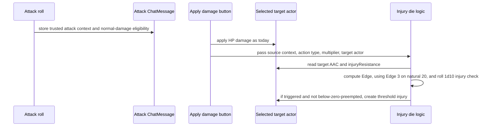

# Add Injury Die Thresholds to Legacy WWN

**Target source repo:** `wwn`

## Overview

This is a variant of the original injury-threshold plan that replaces the natural damage die trigger with a separate injury die rolled at damage-application time. Eligible normal attack damage rolls one injury check per selected recipient:

```text
1d10 >= 8 + injuryResistance - edge
```

The attack's quality still matters through Edge: hit by 5+ gives `edge = 1`, hit by 10+ gives `edge = 2`, and a natural 20 counts as `edge = 3`. AC still affects hit chance and Edge, but no longer directly changes the base injury threshold. Weapon damage die size no longer changes the chance of an injury; it only contributes severity pressure after the injury triggers.

This has large implications compared with the prior plan:

- No trigger probability curve by weapon die type.
- No need to identify a "threshold die" inside multi-die damage formulas.
- Critical hits are the strongest Edge tier, not automatic injuries.
- Damage multipliers affect HP only; they do not affect injury check chance or severity.
- Weapon size remains relevant through post-trigger severity pressure, not injury frequency.

---

## Problem Frame

The prior damage-die threshold model kept injury chance connected to high natural damage rolls, but it made the probability curve too steep across weapon dice and created hard-to-explain edge cases for `d4`, `d6`, and multi-die damage formulas. It also tangled two jobs: deciding whether an injury happens and deciding how bad it is.

This variant intentionally decouples those jobs. Injury chance comes from attack quality and explicit target protection. Severity comes from pressure factors: weapon damage profile, current health, and existing injuries. That keeps the first pass easier to tune during playtesting while preserving the gritty idea that heavier weapons make worse injuries after a wound occurs.

---

## Requirements Trace

### Feature Gate and Actor Data

- R1. Threshold injuries must be disabled by default behind a new world setting.
- R10. Add explicit `injuryResistance` to character and monster actor data and sheets; do not infer it from armor items or AAC.
- R11. Support monster threshold injuries with schema-owned injury counters rather than leaving monster behavior optional.
- R14. Preserve existing HP damage behavior when threshold injuries are disabled or attack context is invalid.
- R17. Account for the source/runtime mismatch: implement in the 1.7.0 source checkout and explicitly sync that source into Foundry for QA.

### Trigger Math

- R2. Eligible positive normal attack damage must resolve threshold triggering per selected recipient at damage-application time.
- R3. Injury chance must use `1d10 >= 8 + injuryResistance - edge`.
- R4. Edge must be computed per recipient from stored attack total versus that recipient's current AAC at damage application.
- R5. Natural 20 critical hits must count as `edge = 3` for injury checks, but must not automatically create an injury.
- R6. Positive attack-damage multiplier buttons, including half and double damage, affect HP only; threshold eligibility, Edge, weapon pressure, and health-pressure severity inputs stay unchanged.

### Damage Eligibility and Precedence

- R7. Shock, healing, trauma damage, manual context-menu damage, environmental damage, and spell damage must not trigger threshold injuries unless a later rule explicitly opts them in.
- R8. Shock that drops a target below 0 HP still follows existing below-zero wound behavior.
- R9. If the existing below-zero wound path actually runs for an attack, it takes precedence over threshold injury creation to avoid double injuries from one damage application.
- R12. Use a light severity roll after the trigger; do not use the existing below-zero severity formula for ordinary threshold injuries.
- R13. Do not add a post-trigger save in this pass.
- R18. Treat Last Stand / staying up at 0 HP as a tabletop rules note only. Do not implement a Foundry actor state, combatant override, or new below-zero automation in this pass.

### Chat Provenance and Permissions

- R15. Store authoritative attack context on system-created chat message data, not rendered DOM attributes.
- R16. Preserve chat visibility, actor update permissions, and idempotency when applying injuries from chat buttons.

---

## Scope Boundaries

- Do not implement the old natural damage die threshold trigger in this variant.
- Do not derive injury chance directly from AAC, armor items, Dex, ActiveEffects, or transient AC modifiers.
- Do not make larger weapon dice more likely to trigger injuries. Larger weapons affect severity only.
- Do not add a below-half-HP trigger-frequency modifier.
- Do not let shock damage trigger threshold injuries.
- Do not let trauma damage trigger threshold injuries in this pass, even though it appears on attack cards.
- Do not add a post-trigger save.
- Do not add a GM-mediated socket mutation path in this pass.
- Do not redesign the full injury table. Start with a small, gentler threshold-injury result set.
- Do not implement automatic armor or monster natural-armor inference. The GM will manually set `injuryResistance`.
- Do not implement a Last Stand state, below-zero action economy, or new death-save automation in Foundry. Last Stand is a GM-facing rules procedure layered on top of the existing below-zero wound behavior.
- Do not implement the SWNR version in this plan.

### Deferred to Follow-Up Work

- Rich attack-tag injury nature tables.
- Automatic `injuryResistance` suggestions from armor, shields, monster stat blocks, or traits.
- A post-trigger save-to-reduce-severity tuning lever if playtesting shows injuries are still too intrusive.
- GM-mediated threshold injury mutation for non-GM damage application, if direct actor update permission proves too restrictive.
- Broader spell, environmental, trap, or special damage eligibility rules.
- Full packaging or release automation beyond local source-to-runtime sync.

---

## Context & Research

### Relevant Code and Patterns

- `system.json`: source checkout is version 1.7.0, Foundry v13-compatible, and loads JavaScript modules directly.
- `package.json`: Node/Mocha tests exist under `tests/node`; Tailwind 4 CSS build requires Node 20+.
- `module/dice.js`: `sendAttackRoll` creates attack and damage rolls; `digestAttackResult` already compares attack total to target AAC.
- `module/item/chat-cards.mjs`: attack-card damage and shock buttons route through `applyChatCardDamage`.
- `module/chat.js`: `applyChatCardDamage(amount, multiplier)` applies chat-card damage to selected controlled tokens.
- `module/actor/entity.js`: `applyDamage(amount, multiplier)` applies HP damage and currently routes below-zero wounds.
- `module/actor/types/character.mjs`: current below-zero wound severity path and injury counter behavior.
- `module/data/actor/character.mjs`: character schema already owns injury and wound counters.
- `module/data/actor/monster.mjs`: monster schema needs explicit injury/wound counters for first-class monster injury support.
- `templates/chat/roll-attack.hbs`: positive damage, half damage, double damage, shock, healing, and trauma buttons need clear eligibility distinctions.
- `templates/actors/partials/character-header.hbs` and `templates/actors/partials/monster-header.hbs`: good locations for visible playtest-facing `injuryResistance`.
- `module/settings.js` and `lang/en.json`: existing world setting and localization patterns.

---

## Rule System Definition

### Eligibility

Threshold injury logic runs only when all of these are true:

- The world setting `thresholdInjuries` is enabled.
- The user applies positive normal attack damage from a trusted WWN attack chat card.
- The target is a selected character or monster actor.
- The damage button is not shock, trauma, healing, manual context-menu damage, environmental damage, spell damage, or another non-attack source.
- The same source message, normal-damage threshold action family, and target have not already attempted a threshold injury check.

Before HP is changed, capture the target's HP state for threshold severity pressure. HP damage is then applied normally. If that HP damage causes the existing below-zero wound path to run, the below-zero wound path wins and threshold injury creation is skipped for that target. This means half and double damage can change HP loss and below-zero preemption, but they do not indirectly change threshold severity through post-damage HP state.

### Trigger Flow

1. Read trusted attack context from the source `ChatMessage`: attack total, natural d20, source item, base weapon damage formula, and visibility.
2. For each selected recipient, read current target AAC and `injuryResistance`.
3. Compute Edge from attack margin, or use critical Edge if the natural d20 is 20:

| Attack margin against current target AAC | Edge |
|---:|---:|
| Less than 0 | Threshold-ineligible; apply HP damage and emit a GM-only skipped-threshold note |
| 0-4 | 0 |
| 5-9 | 1 |
| 10+ | 2 |
| Natural 20 | 3 |

Damage-time AAC is intentional for this variant. If AAC changes after the attack roll but before damage application, threshold Edge uses the current value at the moment the GM applies damage.

4. Roll an injury die:

```text
1d10 >= 8 + injuryResistance - edge
```

5. If the injury triggers, roll severity using `1d6 + totalPressure`.

### Trigger Probability Chart

These odds are exact `1d10` outcomes conditional on an eligible attack damage button being applied.

| Target `injuryResistance` | No Edge | Hit by 5 Edge | Hit by 10 Edge | Natural 20 Edge |
|---:|---:|---:|---:|---:|
| 0 | 8+ = 30% | 7+ = 40% | 6+ = 50% | 5+ = 60% |
| 1 | 9+ = 20% | 8+ = 30% | 7+ = 40% | 6+ = 50% |
| 2 | 10+ = 10% | 9+ = 20% | 8+ = 30% | 7+ = 40% |
| 3 | 11+ = 0% | 10+ = 10% | 9+ = 20% | 8+ = 30% |

Do not clamp the high end down to 10. A target number above 10 means the injury die cannot trigger. That gives rare exceptional protection a clear effect without adding another rule, while natural 20s remain dangerous.

### Severity Pressure

Trigger chance and severity are intentionally separate. Attack quality and `injuryResistance` decide whether an injury happens; pressure decides how bad it is.

Weapon pressure uses the static base weapon damage profile, not the actual damage roll:

| Base weapon damage profile | Weapon pressure |
|---|---:|
| Maximum base weapon damage <= 6, such as d4 or d6 | -1 |
| Maximum base weapon damage 7-9, such as d8 | 0 |
| Maximum base weapon damage >= 10, such as d10, d12, or 2d6 | +1 |

Other pressure inputs:

| Pressure source | Pressure |
|---|---:|
| Pre-damage HP above half | +0 |
| Pre-damage HP at half or below, but above 0 | +1 |
| Existing persistent injuries | +1 each, capped at +2 |
| Natural 20 | +0 |
| Edge | +0 |

Cap total pressure at `+4` for this pass.

Do not add threshold severity pressure for being at 0 HP in this pass. HP is currently clamped at 0, and any damage that produces below-zero excess should use the existing below-zero wound path and preempt threshold injury creation. Last Stand is therefore a table rule about what the actor may choose after the below-zero wound result, not an input to threshold severity.

### Zero HP and Last Stand Rules Note

This plan does not automate Last Stand in Foundry. Foundry should continue to treat HP `0` as it does today for combatant defeated state and below-zero wound routing.

For table rules, use this procedure outside the implementation:

1. When damage would reduce a PC or named NPC below 0 HP, apply HP damage normally and resolve the existing below-zero wound roll from excess damage.
2. If the wound result knocks the actor unconscious, they drop as usual.
3. If the wound result does not knock them unconscious, the GM may allow a Last Stand choice, such as a Physical save or adjudicated stay-standing option.
4. While standing at 0 HP, further damage should continue using the existing below-zero wound rules, with accumulated injuries making later results worse.
5. Ordinary monsters and unimportant NPCs should usually drop at 0 HP to keep fights from dragging.

This note is intentionally non-binding implementation context. It exists so future rules documentation does not confuse Last Stand with the threshold injury feature.

Conditional severity after a threshold trigger, using exact `1d6 + totalPressure` outcomes:

| Total pressure | Minor | Moderate | Serious | Severe |
|---:|---:|---:|---:|---:|
| -1 | 67% | 33% | 0% | 0% |
| 0 | 50% | 33% | 17% | 0% |
| +1 | 33% | 33% | 33% | 0% |
| +2 | 17% | 33% | 33% | 17% |
| +3 | 0% | 33% | 33% | 33% |
| +4 | 0% | 17% | 33% | 50% |

### Persistence

| Severity band | Persistent injury counter? | Intended effect shape |
|---|---:|---|
| Minor | No | Bruise, cut, stagger, cosmetic injury, or very short-lived penalty |
| Moderate | Yes | Small penalty, treatment need, or rest need |
| Serious | Yes | Meaningful combat penalty or longer recovery |
| Severe | Yes | Rare result requiring stacked pressure; avoid extreme outcomes in the first pass |

### Actor and Sheet Contract

`injuryResistance` is the single GM-facing protection stat for injury rules. It raises the threshold-injury target number and subtracts from below-zero wound severity.

| Contract point | Decision |
|---|---|
| Data type | Non-negative integer numeric field, default `0`, step `1` |
| Recommended playtest range | `0-3` |
| Values above 3 | Allowed only as explicit GM exceptional protection; helper text should warn that these values can make low-Edge injuries impossible and critical injuries rare |
| Blank, missing, or non-finite values | Normalize to `0` in helper logic |
| Decimal values | Reject or normalize to an integer consistently; do not silently preserve fractional thresholds |
| Non-GM access | Read-only or hidden for non-GM users unless a later explicit rule allows player editing |

On character and monster sheets, place `injuryResistance` in the same defense cluster as AAC. Use the localized label `Injury Resistance`. Do not expose a separate Critical Resistance/CR field. Injury and wound counters should live in the HP/status counter cluster on both character and monster sheets when either `replaceStrainWithWounds` or `thresholdInjuries` is enabled. Character and monster sheets should use the same label, order, and visibility behavior unless a template-specific constraint is documented in the implementation.

Default `0` means intentionally unprotected, not "unconfigured." Manual QA and playtest setup must assign representative actors to `injuryResistance` 0-3 before drawing tuning conclusions.

### Chat, Provenance, and Idempotency

Threshold context is trusted only when it comes from the system attack-roll path, not from rendered chat HTML or user-authored flags. The damage handler must re-read the source `ChatMessage` by id and validate:

- WWN system-created attack-card metadata exists in the expected flag namespace and schema version.
- The context was written by the system attack roll path, not by arbitrary message content.
- The source actor and source item identity are present, or the source item snapshot was captured by the system roll path when the item existed.
- The button role is represented by trusted metadata, not only by DOM `data-*` attributes.
- The action is eligible positive normal attack damage.
- Malformed, user-authored, or inconsistent threshold metadata fails closed for threshold logic while preserving ordinary HP damage behavior where the existing system allows it.

Use a stable threshold action family for idempotency. Positive normal, half, and double attack-damage buttons all share the same threshold action family because multipliers do not change threshold eligibility or severity inputs. Shock, trauma, healing, and other non-eligible actions have explicit non-threshold action ids.

Persist threshold-attempt markers on the target actor, keyed by:

```text
source ChatMessage UUID + target actor/token UUID + threshold action family
```

Set the marker after an eligible threshold check attempt whether or not the injury die succeeds, so repeat clicks cannot reroll until an injury appears. Invalid context does not set the marker because no trusted threshold attempt occurred.

### Mutation Authority

This pass does not add a GM-mediated socket mutation path. Persistent threshold injury state and threshold-attempt markers may be written only by a user who can update the target actor. If the user cannot update the target actor, apply only the existing HP damage behavior that the current system permits, skip threshold injury mutation, and emit a GM-only note when the source looked threshold-eligible.

If a later pass adds GM-mediated mutation, the GM side must rehydrate the source message, target actor/token, trusted action id, idempotency key, and requester permission, then compute trigger and severity on the GM side. It must not accept client-computed injury results.

### Chat Outcome States

| State | Player-facing behavior | GM-only behavior |
|---|---|---|
| Triggered injury | Show target, injury die, target number, Edge source, severity band, and effect/location when visible under the source message visibility | Same details, including hidden roll context if the source was GM-only |
| No trigger | No extra player-facing noise | Optional concise debug only if a future setting enables it |
| Mixed multi-target apply | Show visible triggered injuries as a consolidated summary | Include per-target skipped or hidden reasons as needed |
| All targets ineligible | Preserve ordinary damage output | Consolidated skipped-threshold note when the source looked threshold-eligible |
| Validation failure after HP damage | Preserve ordinary damage output | Skipped-threshold note with validation reason |
| Permission failure | Preserve ordinary damage output where current permissions allow it | Note that threshold mutation was skipped for lack of actor update permission |
| Below-zero wound preemption | Existing below-zero wound output | Note threshold skipped because below-zero wound path took precedence |
| Duplicate threshold attempt | No second injury roll | Note duplicate threshold attempt if useful for debugging |
| Unexpected helper or roll error | HP damage should not be rolled back because threshold failed | Error note to GM and console/log diagnostic |

### GM Flow

1. Enable the `thresholdInjuries` world setting.
2. Open relevant character and monster sheets.
3. Assign `injuryResistance` values before playtest: 0 unprotected/light, 1 medium/modest natural armor, 2 heavy/strong natural armor, 3 rare exceptional protection.
4. Make an attack roll through the WWN system attack flow.
5. Select one or more damage recipients.
6. Click normal, half, or double positive attack damage.
7. Review public or GM-only chat output, including skipped-threshold notes.
8. Confirm actor counters and any threshold-attempt markers.
9. For no selected target, invalid attack context, disabled setting, permission failure, or below-zero wound preemption, verify HP damage behavior follows the current system and threshold logic skips predictably.

### Accessibility and Responsive Behavior

- `injuryResistance` must have a localized accessible label and helper/title text.
- The numeric input must be keyboard-editable and not rely on color alone for validation state.
- Severity output must include text labels; color may supplement but not replace text.
- Damage-button focus should remain stable after click handling; unexpected focus loss should not be required to understand the result.
- New or affected buttons should preserve the existing system's touch target sizing.
- Character and monster sheet placement should remain usable in narrow sheet widths and should not obscure HP, AAC, or injury/wound fields.

### Playtest Tuning Criteria

Treat the first implementation as a measurement pass. Before changing constants, run representative encounters with actors assigned to `injuryResistance` 0-3 and record: eligible hits, Edge tier, criticals, injury triggers, severity bands, existing injury count, and whether the GM or players felt the result interrupted play.

Initial target shape:

- Unprotected or lightly protected targets should feel at meaningful risk, especially on high-Edge hits, but should not receive persistent injuries from most ordinary hits.
- Medium and heavy protection should visibly reduce ordinary injury frequency.
- Minor results should be common enough that a trigger does not always become a long-term penalty.
- If trigger frequency feels too high across protection levels, raise the base target from `8+` to `9+` before adding a new mechanic.
- If trigger frequency feels right but outcomes are too punitive, tune severity pressure or result bands before changing trigger odds.

---

## Key Technical Decisions

- Implement this as a new variant, not an in-place edit of the old damage-die plan, because the trigger model changes the implementation shape.
- Use `1d10` for injury checks. It gives clean 10-point increments and matches the desired rough tiers: 20%, 30%, and 50% are easy to express.
- Keep the base injury target at `8+`. With `injuryResistance` 0-2 and Edge 0-2, this yields 10-50% trigger chances across normal playtest cases.
- Allow target numbers above 10 to be impossible instead of clamping them. `injuryResistance` 3 should be exceptional protection that can block no-Edge injury checks.
- Natural 20 critical hits count as Edge 3 on the normal injury die check.
- Compute injury checks per selected recipient, not per attack card. The same attack card applied to two targets may trigger on one and not the other.
- Compute Edge at damage-application time against each selected recipient's current AAC. If AAC changed after the attack roll, the changed value is intentionally used.
- Store attack total, natural d20, source item identity, base weapon damage formula, normal-damage eligibility, and source visibility/provenance on trusted chat message data.
- Capture the static base weapon damage formula before attack-time mutations such as burst or situational damage are appended to the HP damage roll.
- Do not store or use the natural damage die result for trigger logic in this variant.
- Treat trauma damage as not threshold-eligible in this pass, even when it is displayed on an attack card.
- Preserve current HP damage behavior first. Injury logic is additive and must skip cleanly on invalid or missing context.
- Use a separate threshold injury creation path. Do not reuse the existing below-zero severity formula for ordinary attack injuries.
- Do not add extra severity pressure for natural 20 in this pass. The critical hit's benefit is stronger trigger Edge.
- Capture pre-damage HP for threshold severity pressure so positive damage multipliers cannot indirectly change severity through post-damage HP state.
- Minor threshold results should not increment the persistent `system.hp.injuries` counter. Moderate, Serious, Severe, and existing below-zero wounds do increment persistent injuries.
- Add `injuryResistance`, `system.hp.injuries`, and `system.hp.wounds` support to monsters so monster threshold behavior is not an optional branch.
- Use a GM-only skipped-threshold note only when a button looked threshold-eligible but validation failed. Do not produce skipped notes for intentionally ineligible sources such as shock, healing, trauma, or context-menu damage.
- Use idempotency keyed by source chat message, target token/actor, and the normal-damage threshold action family so repeated clicks cannot reroll or create duplicate injuries from the same apply action.
- Require actor update permission for persistent threshold injury mutation in this pass; do not add a GM-mediated socket path yet.
- Preserve existing Foundry behavior for HP `0`, combatant defeated state, and below-zero wound routing. Last Stand is a table procedure only, not a feature implementation unit.

---

## High-Level Technical Design

> This illustrates the intended approach and is directional guidance for review, not implementation specification. The implementing agent should treat it as context, not code to reproduce.



Damage source decision matrix:

| Damage source | Threshold eligible? | Injury chance input | Severity input |
|---|---:|---|---|
| Normal attack damage | Yes | `1d10 >= 8 + injuryResistance - edge` | weapon pressure, health pressure, existing injury pressure |
| Half normal attack damage | Yes | Same as normal damage | Same as normal damage; multiplier affects HP only |
| Double normal attack damage | Yes | Same as normal damage | Same as normal damage; multiplier affects HP only |
| Natural 20 normal damage | Yes | Edge 3 on the normal injury check | No extra natural-20 severity pressure |
| Shock | No | None | Existing below-zero path only if HP drops below 0 |
| Trauma damage | No in this pass | None | None |
| Healing | No | None | None |
| Context-menu/manual damage | No | None | None |

---

## Implementation Units

- U1. **Establish Source, Build, and Runtime Loop**

**Goal:** Make the implementation path explicit: edit source, run checks, build CSS when needed, and load the same source in Foundry.

**Requirements:** R17

**Dependencies:** None

**Files:**
- Modify: `README.md` or a local implementation note if the repo has one
- Reference: `package.json`
- Reference: `system.json`
- Test: `tests/node/*.spec.js`

**Approach:**
- Treat the 1.7.0 source checkout as canonical.
- Do not edit the installed Foundry package as source.
- Use Node 20+ for dependency install and CSS build.
- Preserve the source-to-runtime loop: source edit, automated tests, CSS build if needed, then symlink or copy the built source checkout into Foundry's system directory for QA.

**Execution note:** Characterization-first for existing damage behavior before changing routing.

**Test scenarios:**
- Build path: the implementer can run the existing Node test suite before feature work.
- Runtime path: Foundry loads the 1.7.0 source checkout, not the older installed package.
- Regression posture: existing damage buttons and below-zero wounds are characterized before threshold routing changes.

**Verification:**
- The implementer can state which directory is canonical source and which directory Foundry is loading for runtime QA.

---

- U2. **Add Core Setting, Actor Data, and Sheet Fields**

**Goal:** Add the opt-in switch and visible actor protection stat before damage routing depends on them.

**Requirements:** R1, R10, R11, R14

**Dependencies:** U1

**Files:**
- Modify: `module/settings.js`
- Modify: `lang/en.json`
- Modify: `module/data/actor/character.mjs`
- Modify: `module/data/actor/monster.mjs`
- Modify: `module/actor/character-sheet-v2.js`
- Modify: `module/actor/monster-sheet-v2.js`
- Modify: `templates/actors/partials/character-header.hbs`
- Modify: `templates/actors/partials/monster-header.hbs`
- Modify: `templates/actors/partials/character-attributes-tab.hbs` if counter visibility lives there
- Modify: `templates/actors/partials/monster-attributes-tab.hbs`
- Test: `tests/node/injury-settings.spec.js`

**Approach:**
- Add a world setting named `thresholdInjuries`, disabled by default.
- Add `injuryResistance` to character and monster TypeDataModels as a non-negative integer with default `0`.
- Add schema-owned `system.hp.injuries` and `system.hp.wounds` fields for monsters.
- Display `injuryResistance` on character and monster sheets in the defense cluster near AAC.
- Make `injuryResistance` read-only or hidden for non-GM users in this pass.
- Show injury/wound counters when either `replaceStrainWithWounds` or `thresholdInjuries` is enabled.
- Keep expected GM playtest values visible in documentation and helper text: `0` intentionally unprotected or light protection, `1` medium or modest natural armor, `2` heavy or strong natural armor, `3` rare exceptional protection.
- Do not silently preserve invalid input: blank, missing, or non-finite values normalize to `0`; decimals are rejected or normalized consistently to an integer.

**Patterns to follow:**
- Existing settings registration in `module/settings.js`.
- Existing character header fields for AAC and injury/wound counters.
- Existing character HP injury/wound schema.

**Test scenarios:**
- Happy path: `thresholdInjuries` defaults to disabled.
- Happy path: character and monster actors default `injuryResistance` to `0`.
- Happy path: monster actors own injury and wound counters in schema.
- Happy path: enabling threshold injuries reveals injury/wound counters even when `replaceStrainWithWounds` is disabled.
- Happy path: `injuryResistance` appears in the same relative sheet location and order on character and monster sheets.
- Authorization: a non-GM actor owner cannot edit `injuryResistance`.
- Edge case: missing or invalid `injuryResistance` normalizes to `0`.
- Regression: existing `replaceStrainWithWounds` visibility and behavior remain unchanged.

**Verification:**
- A GM can open a character or monster sheet, see `injuryResistance`, edit it, and see injury/wound counters when threshold injuries are enabled.

---

- U3. **Add Pure Injury Die and Severity Helpers**

**Goal:** Isolate trigger, Edge, idempotency inputs, and severity pressure math in testable helpers.

**Requirements:** R2, R3, R4, R5, R9, R12, R13

**Dependencies:** U2

**Files:**
- Create or modify: `module/injury-thresholds.mjs`
- Modify: `wwn.js` if exports or eager imports are needed
- Test: `tests/node/injury-thresholds.spec.js`

**Approach:**
- Add helper logic for:
  - `injuryResistance` lookup with default `0`.
  - Injury target number: `8 + injuryResistance - edge`.
  - Target number above 10 means impossible on `1d10`.
  - Edge from `attackTotal - target.system.aac.value`.
  - Negative attack margin is threshold-ineligible unless the natural d20 is 20.
  - Natural 20 critical Edge 3.
  - Eligibility checks for positive normal attack damage only.
  - Static weapon pressure from base weapon damage formula maximum.
  - Health pressure from the pre-damage HP snapshot: above half HP `+0`, half HP or below but above 0 HP `+1`.
  - Existing injury pressure: `+1` per persistent injury, capped at `+2`.
  - Total pressure cap at `+4`.
  - Severity roll bands using `1d6 + totalPressure`.
- Keep helpers independent of rendered chat HTML and Foundry UI APIs where possible.

**Patterns to follow:**
- Existing AAC access in `module/dice.js` and actor data access in `module/actor/entity.js`.
- Existing Node/Mocha pure helper tests under `tests/node`.

**Test scenarios:**
- Happy path: `injuryResistance` 0 with no Edge uses target 8+ and has 30% chance.
- Happy path: `injuryResistance` 1 with hit-by-5 Edge uses target 8+.
- Happy path: `injuryResistance` 2 with hit-by-10 Edge uses target 8+.
- Edge case: `injuryResistance` 3 with no Edge uses target 11+ and cannot trigger on `1d10`.
- Edge case: natural 20 uses Edge 3 even when attack margin is lower than 10.
- Edge case: natural 20 against `injuryResistance` 3 uses target 8+ and has 30% chance.
- Edge case: hit by 5 gives Edge 1; hit by 10 gives Edge 2.
- Edge case: attack margin below 0 skips threshold logic and returns a skipped-threshold reason.
- Edge case: missing target AAC gives no margin Edge but does not crash.
- Happy path: d4/d6 base profiles produce weapon pressure `-1`.
- Happy path: d8 base profile produces weapon pressure `0`.
- Happy path: d10/d12 and 2d6 base profiles produce weapon pressure `+1`.
- Edge case: unparseable weapon damage formula falls back to normal weapon pressure `0` and does not block injury processing.
- Severity: total pressure `-1` cannot produce Serious or Severe.
- Severity: total pressure `+4` can produce Severe on 4-6.
- Severity: half and double damage use the same pre-damage health pressure as normal damage.

**Verification:**
- The injury trigger and severity math can be tested without rolling or rendering a chat card in Foundry.

---

- U4. **Capture Trusted Attack Context on Chat Messages**

**Goal:** Preserve enough attack-roll information for later damage application without depending on rendered DOM state.

**Requirements:** R4, R5, R7, R15, R16

**Dependencies:** U3

**Files:**
- Modify: `module/dice.js`
- Modify: `module/item/chat-cards.mjs`
- Modify: `templates/chat/roll-attack.hbs`
- Test: `tests/node/attack-context.spec.js`

**Approach:**
- In `sendAttackRoll`, store trusted system-owned context on the attack `ChatMessage`:
  - attack total
  - natural d20
  - source actor and item identity
  - base weapon damage formula captured before burst, situational, or rendered-roll mutations are appended to the HP damage formula
  - trusted threshold action ids for each apply button
  - whether each apply button represents normal attack damage, shock, healing, or trauma
  - original message visibility data needed for follow-up chat
- Do not store a natural threshold damage die result; this variant does not need one.
- Keep rendered `data-*` attributes as button presentation and routing hints only.
- Treat ChatMessage flags as untrusted until validated: re-read the message by id, require the expected WWN attack-card flag namespace and schema version, verify source actor/item provenance or system-captured item snapshot, and reject malformed or user-authored threshold metadata.
- Let `module/item/chat-cards.mjs` retrieve trusted context from the message and pass it through to `applyChatCardDamage`.
- Distinguish normal attack damage buttons from trauma damage buttons even though both use `data-action="apply-damage"` today.

**Patterns to follow:**
- Existing `rollTitle`, `dmgTitle`, and attack-card template data flow.
- Existing chat card action handling in `module/item/chat-cards.mjs`.

**Test scenarios:**
- Happy path: normal attack damage buttons can retrieve attack total, natural d20, source item identity, and base weapon damage formula from trusted message data.
- Happy path: base weapon formula for severity pressure excludes burst or situational HP damage additions.
- Happy path: natural 20 context is available even if total attack margin is less than 10.
- Happy path: normal, half, and double buttons all map to the same threshold action family.
- Edge case: untargeted attack cards still store attack total and can compute Edge against selected recipients later.
- Edge case: shock and trauma buttons are explicitly marked non-threshold.
- Error path: stale, missing, or malformed context is rejected for threshold injury logic while HP damage still applies.
- Security: rendered DOM changes cannot forge threshold eligibility.
- Security: forged ChatMessage flags cannot forge threshold eligibility.

**Verification:**
- Damage application can access trusted attack context without scraping the rendered roll HTML.

---

- U5. **Route Damage Application Through Per-Recipient Injury Checks**

**Goal:** Apply HP damage as today, then run target-specific injury checks only for validated eligible attack damage.

**Requirements:** R2, R4, R5, R6, R7, R8, R9, R14, R16, R18

**Dependencies:** U3, U4

**Files:**
- Modify: `module/item/chat-cards.mjs`
- Modify: `module/chat.js`
- Modify: `module/actor/entity.js`
- Test: `tests/node/damage-threshold-integration.spec.js`

**Approach:**
- Extend `applyChatCardDamage` to accept optional validated threshold context while preserving the existing `(amount, multiplier)` caller shape.
- Extend `applyDamage` to accept optional context without breaking current callers.
- Gate all threshold logic behind `thresholdInjuries`.
- Capture pre-damage HP state before applying HP damage so health pressure is stable across normal, half, and double damage buttons.
- Apply HP damage first, preserving current multiplier behavior.
- For each selected recipient, compute Edge from stored attack total versus that recipient's current AAC.
- Roll an independent `1d10` injury check for each selected recipient, using Edge 3 for natural 20 critical hits.
- Keep half and double damage threshold-eligible for normal attack damage, but apply the multiplier only to HP loss.
- Skip threshold injury logic for shock, healing, trauma, context-menu damage, missing context, invalid provenance, and disabled setting.
- Skip threshold injury logic when attack margin against current AAC is below 0, unless the natural d20 is 20.
- If HP damage causes the existing below-zero wound path to run, skip threshold injury creation for that target.
- Enforce actor update permission directly. Do not add a GM-mediated mutation handler in this pass.
- Add idempotency so repeated clicks of the same source message, target, and normal-damage threshold action family cannot reroll or create duplicate threshold injuries for the same target.
- Persist threshold-attempt markers on the target actor as part of the same actor update authority boundary used for injury mutation.
- Emit one consolidated GM-only skipped-threshold note per apply action when a supposedly eligible normal attack fails validation.

**Patterns to follow:**
- Existing selected-token application flow in `module/chat.js`.
- Existing `applyDamage(amount, multiplier)` behavior in `module/actor/entity.js`.
- Existing below-zero wound routing in `applyDamage`.

**Test scenarios:**
- Happy path: normal attack damage applies HP damage and rolls one injury check for one selected target.
- Happy path: one attack card applied to two selected targets rolls independent checks and uses each target's AAC and `injuryResistance`.
- Happy path: hit by 5 improves injury chance for one recipient without affecting another recipient with higher AAC.
- Happy path: natural 20 uses Edge 3 and still rolls `1d10`.
- Happy path: natural 20 against `injuryResistance` 3 triggers on 8+, not automatically.
- Edge case: half damage and double damage change HP loss only.
- Edge case: half damage and double damage do not change health-pressure severity because pre-damage HP is used.
- Edge case: attack margin below 0 applies HP damage but skips threshold logic with a GM-only reason.
- Edge case: AAC changed between attack roll and damage application uses the changed current AAC.
- Edge case: shock damage never runs threshold logic, but below-zero shock still follows existing below-zero behavior.
- Edge case: trauma damage never runs threshold logic.
- Edge case: context-menu damage never runs threshold logic.
- Edge case: a target reduced below 0 by an attack uses the existing below-zero path and skips threshold injury creation if that path runs.
- Error path: malformed attack context applies HP damage and emits only a GM skipped-threshold note.
- Authorization: a user without actor update permission cannot create persistent threshold injury state directly.
- Authorization: no GM-mediated socket mutation path exists in this pass.
- Idempotency: clicking normal, half, or double from the same eligible source message for the same target cannot reroll threshold after the first eligible threshold attempt.
- Regression: disabled `thresholdInjuries` preserves current HP damage and below-zero behavior exactly.
- Regression: no Last Stand actor state, combatant override, or death-save automation is introduced.

**Verification:**
- Existing damage application still works, and threshold injury checks appear only for intended normal attack damage.

---

- U6. **Create Threshold Injuries and Chat Output**

**Goal:** Create gentler threshold injury results, update persistent counters only when appropriate, and report results clearly.

**Requirements:** R11, R12, R13, R16

**Dependencies:** U5

**Files:**
- Modify: `module/actor/entity.js`
- Modify: `module/actor/types/character.mjs`
- Modify: `templates/chat/apply-damage.hbs` or create a focused threshold injury chat template
- Modify: `lang/en.json`
- Test: `tests/node/threshold-injury-creation.spec.js`

**Approach:**
- Add a threshold-specific injury creation method separate from the existing below-zero wound method.
- Roll severity as `1d6 + totalPressure`.
- Use severity bands:

| Severity score | Result band | Persistent injury counter? | Intended effect shape |
|---:|---|---:|---|
| 3 or less | Minor | No | Bruise, cut, stagger, cosmetic injury, or very short-lived penalty |
| 4-5 | Moderate | Yes | Small penalty, treatment need, or rest need |
| 6-7 | Serious | Yes | Meaningful combat penalty or longer recovery |
| 8+ | Severe | Yes | Rare result requiring stacked pressure; avoid extreme outcomes in the first pass |

- Preserve existing below-zero wound behavior and counters.
- Produce threshold injury chat output that includes target, trigger source, injury die result, target number, Edge source when relevant, severity band, and effect/location when available.
- Preserve source attack visibility: public source attacks produce public follow-up injury output; GM-only or blind source attacks should not reveal hidden details to players.
- Use text severity labels in chat output; color may supplement but must not be the only severity signal.
- Provide generic fallback effects if no location or effect table entry is available.
- Keep no-trigger cases quiet for players.

**Patterns to follow:**
- Existing injury chat output in `module/actor/types/character.mjs`.
- Existing `templates/chat/apply-damage.hbs` styling.

**Test scenarios:**
- Happy path: a triggered Minor injury creates chat output but does not increment `system.hp.injuries`.
- Happy path: a triggered Moderate injury increments persistent injuries once.
- Happy path: Serious and Severe results increment persistent injuries once.
- Happy path: monster threshold injuries update monster-owned counters.
- Happy path: existing injuries increase severity pressure, capped at `+2`.
- Happy path: health at or below half HP increases severity pressure without changing trigger chance.
- Edge case: natural 20 adds no extra severity pressure.
- Edge case: unparseable weapon damage falls back to normal severity pressure.
- Edge case: duplicate threshold attempt produces no second injury roll.
- Edge case: below-zero wound preemption produces existing wound output and a GM-only threshold skip reason.
- Visibility: threshold injury output preserves public, GM-only, and blind-roll visibility.
- Accessibility: severity is understandable without color.
- Regression: existing below-zero wound chat output remains unchanged.

**Verification:**
- Threshold injuries are visible and useful without producing automatic high-severity spikes from ordinary hits.

---

- U7. **Manual Foundry QA, Probability Verification, and Documentation**

**Goal:** Prove the feature in Foundry, verify the expected probability tables, and document the GM-facing rule.

**Requirements:** R1-R18

**Dependencies:** U1, U2, U3, U4, U5, U6

**Files:**
- Modify: `README.md` or a local GM/testing note
- Reference or update probability helper scripts only if helper tests cannot clearly verify the trigger and severity tables; otherwise rely on `tests/node/injury-thresholds.spec.js`
- Test: manual Foundry QA checklist

**Approach:**
- Verify the `1d10` trigger table for `injuryResistance` 0-3 and Edge 0-3 with a small script or direct helper tests.
- Verify natural 20 critical hits use Edge 3 rather than automatic triggering.
- Verify conditional severity curves for total pressure -1 through +4.
- Run representative encounter-frequency checks that combine hit chance, attack margins, AAC, criticals, and `injuryResistance`, not only conditional injury-die probabilities.
- Before playtest, assign `injuryResistance` values for every actor in the encounter and record those values with the results.
- In Foundry, test:
  - unprotected character or monster, `injuryResistance` 0
  - medium/natural protection, `injuryResistance` 1
  - heavy/strong natural protection, `injuryResistance` 2
  - exceptional protection, `injuryResistance` 3
  - same attack card applied to multiple selected recipients
  - natural 20 Edge 3 injury chance
  - current AAC changed after attack roll but before damage application
  - attack margin below 0 against current AAC
  - half and double damage buttons
  - shock, trauma, healing, and context-menu damage as non-threshold
  - below-zero interaction
  - public, GM-only, and blind attack visibility
  - non-GM actor owner cannot edit `injuryResistance`
  - non-GM or unauthorized user cannot create persistent threshold injury state
- Document the GM rule summary:
  - roll `1d10` on eligible attack damage
  - target number is `8 + injuryResistance - edge`
  - Edge comes from attack margin, with natural 20 counting as Edge 3
  - weapon size affects severity only
  - `injuryResistance` is manually edited during playtesting
  - default `injuryResistance` 0 means intentionally unprotected, not unconfigured
  - tune base target only after representative actors have assigned `injuryResistance`

**Patterns to follow:**
- Existing Foundry chat-card damage workflow.
- Existing probability helper style from `docs/plans/injury-threshold-probabilities.mjs`.

**Test scenarios:**
- Integration: `injuryResistance` 0 no-Edge target triggers on 8+.
- Integration: `injuryResistance` 2 no-Edge target triggers on 10+.
- Integration: `injuryResistance` 3 no-Edge target cannot trigger on `1d10`.
- Integration: natural 20 against `injuryResistance` 3 triggers on 8+.
- Integration: attack total 21 against AAC 16 gives Edge 1.
- Integration: attack total 26 against AAC 16 gives Edge 2.
- Integration: attack total 15 against AAC 16 applies HP damage but skips threshold logic.
- Integration: AAC changing between attack roll and damage application affects Edge by design.
- Integration: half and double damage preserve the same pre-damage health pressure for severity.
- Integration: same attack against higher AAC may have lower Edge for that recipient.
- Integration: d4/d6 weapons create lighter severity pressure after trigger.
- Integration: d10/d12 or 2d6 weapons create heavier severity pressure after trigger.
- Rules note: Last Stand is not automated; HP 0 and below-zero wound behavior remain the existing Foundry behavior.
- Integration: representative encounter-frequency estimates are recorded before changing the base target from 8+.
- Regression: setting disabled produces the current system behavior.

**Verification:**
- The feature can be demonstrated in Foundry with visible chat evidence, actor counter updates, and probability tables that match the helper tests.

---

## System-Wide Impact

- **Attack context:** `module/dice.js` no longer needs to expose a natural threshold damage die, but it does need to persist attack total, natural d20, source item, and base weapon formula.
- **Damage routing:** `module/item/chat-cards.mjs`, `module/chat.js`, and `module/actor/entity.js` become the core integration path for target-specific injury checks.
- **Actor data:** monster actors gain injury-relevant schema fields, bringing them closer to character support for this feature.
- **Sheet UX:** `injuryResistance` becomes a GM-facing stat on character and monster sheets.
- **Chat visibility:** threshold output must preserve the visibility semantics of the source attack message.
- **Permissions:** persistent injury state and threshold-attempt markers require actor update permission in this pass; GM-mediated mutation is deferred.
- **Zero HP:** Last Stand is rules-only context. This implementation preserves existing HP 0 defeated behavior and existing below-zero wound routing.
- **Testing:** pure math and routing helpers can be covered in Node tests, but chat rendering, selected-token behavior, and visibility need Foundry QA.

---

## Risks & Mitigations

| Risk | Mitigation |
|------|------------|
| Injury chance feels disconnected from high damage rolls | Keep weapon damage relevant through severity pressure and clearly document that trigger chance is attack quality plus target protection |
| Injury chance is still too high | Start disabled by default; tune base target from 8+ to 9+ before adding more mechanics |
| Playtest data is biased by unconfigured actors | Treat default `injuryResistance` 0 as intentionally unprotected and require encounter setup to assign representative values before tuning |
| Severity becomes too punitive | Do not count Minor as persistent injuries; keep Edge out of severity; cap total pressure |
| Multi-click damage buttons create duplicate injuries | Add idempotency keyed by message, target, and the normal-damage threshold action family; mark attempts whether or not they trigger |
| Trauma damage accidentally inherits normal attack eligibility | Store button/action eligibility explicitly in trusted chat context |
| Invalid or stale context blocks damage | HP damage applies first and threshold logic skips with a GM-only note |
| Unauthorized clients mutate injuries | Require actor update permission for threshold mutation in this pass; defer any GM-mediated mutation path |
| User-authored message flags forge attack context | Rehydrate the source message and validate system-created WWN attack metadata before using threshold context |
| Foundry loads the older installed system | Explicit runtime sync and version check before manual QA |
| Last Stand is mistaken for implementation scope | Document it as a rules-only note and preserve existing HP 0 defeated behavior |

---

## Alternative Approaches Considered

- **Natural damage die threshold:** Preserves connection to high damage rolls, but creates steep probability gaps between d4/d6/d8/d10/d12 and ambiguous multi-die behavior.
- **Attack quality only:** Very simple and uses data already present on attack cards, but makes injury chance too detached from the damage application step and leaves weapon profile relevant only if severity logic is added anyway.
- **Total damage threshold:** Easy to understand at the table, but modifiers, warrior bonuses, burst fire, half/double buttons, and multi-die formulas make it hard to keep consistent.
- **Post-trigger save:** Adds a strong tuning lever, but slows the flow and makes this first pass harder to evaluate.
- **Full weapon-size tables:** More simulationist, but too much table administration for the current implementation goal.

---

## Documentation / Operational Notes

- Document that `injuryResistance` is manual during playtesting.
- Document that medium armor or modest natural armor usually maps to `1`; heavy armor or strong natural armor usually maps to `2`.
- Document that AC affects injury chance only through hit chance and Edge, not through `injuryResistance`.
- Document that weapon damage profile affects injury severity only.
- Document that half and double damage affect HP only, while threshold severity uses the pre-damage HP snapshot.
- Document that damage-time AAC is intentional, including delayed damage clicks after AAC changes.
- Document that natural 20 counts as Edge 3, not automatic injury.
- Document that non-GM users cannot edit `injuryResistance` in this pass.
- Document that Last Stand is a table procedure only; the Foundry implementation still treats HP 0 and below-zero wounds using existing behavior.
- Document the source-to-runtime workflow for local Foundry testing.
- Preserve the original damage-die plan as a comparison artifact; do not overwrite it unless this variant is formally adopted.

---

## Deferred / Open Questions

- Exact threshold injury descriptions and penalties are implementation-owned, as long as they respect the Minor/Moderate/Serious/Severe bands above.
- GM-mediated mutation is out of scope for this pass; if direct actor update permissions prove insufficient, design that socket path as follow-up work with GM-side revalidation and recomputation.
- Exact runtime sync method is implementation-owned: symlink is preferred for local iteration, copy is acceptable for package-style testing.

---

## Sources & References

- Variant source plan: `docs/plans/2026-05-12-001-feat-wwn-injury-thresholds-plan.md`
- Probability helper for prior model: `docs/plans/injury-threshold-probabilities.mjs`
- Related code: `module/actor/entity.js`
- Related code: `module/actor/types/character.mjs`
- Related code: `module/chat.js`
- Related code: `module/dice.js`
- Related code: `module/item/chat-cards.mjs`
- Related code: `module/data/actor/character.mjs`
- Related code: `module/data/actor/monster.mjs`
- Related code: `module/settings.js`
- Related code: `templates/chat/roll-attack.hbs`
- Related code: `templates/actors/partials/character-header.hbs`
- Related code: `templates/actors/partials/monster-header.hbs`
- Related tests: `tests/node/*.spec.js`
- Runtime manifest source: `system.json`
- Build and test source: `package.json`
