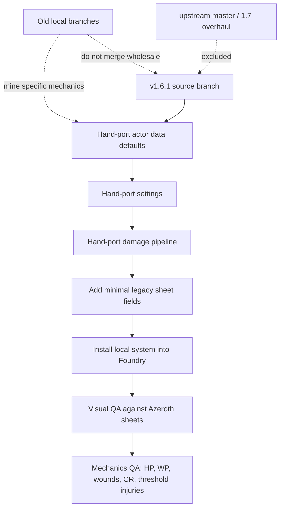

# Hand-Port Local WWN Mechanics onto v1.6.1

## Overview

Port the local Wound Points, Critical Resistance, and injury-dice threshold mechanics onto the upstream `v1.6.1` release baseline without carrying over upstream `master`/1.7 sheet, CSS, AppV2, Tailwind, or pack-format changes.

The implementation target is the `feat/injury-dice-thresholds-v1.6.1` branch, based on tag `v1.6.1` (`079269c`). This branch should remain visually compatible with the Foundry-installed `v1.6.1` system so the real Azeroth world can be opened and tested without the broken 1.7 sheet overhaul.

---

## Problem Frame

The previous local threshold implementation was built on a local `master` that had already fast-forwarded to upstream `master` commit `d008cbb` ("Overhaul checkpoint"). That commit identifies itself as `1.7.0` and contains unreleased visual/sheet architecture changes. Foundry's latest published upstream release is `v1.6.1`, so installing the local branch over the Foundry system replaced stable 1.6.1 sheets with the unreleased overhaul.

The fix is not to revert isolated CSS lines. The fix is to treat `v1.6.1` as the base and hand-port only the local mechanics, using legacy 1.6.1 file structures and templates.

---

## Requirements Trace

- R1. Keep upstream `v1.6.1` as the visual and runtime baseline.
- R2. Do not cherry-pick or merge wholesale from `feat/wound-points`, `feat/injury-dice-thresholds`, `master`, or `upstream/master` if doing so brings 1.7/AppV2/Tailwind sheet changes.
- R3. Preserve 1.6.1 character and monster sheet layout except for minimal legacy-layout fields required for local mechanics.
- R4. Port Wound Points as an opt-in world setting with character and monster data and excess-damage routing.
- R5. Port below-zero wound behavior for characters and monsters, including injury and wound counters, without removing System Strain from sheets.
- R6. Port Critical Resistance for below-zero wound severity reduction.
- R7. Port the injury-dice threshold system from the existing plan: opt-in setting, trusted attack chat context, eligible normal attack damage only, repeated applications allowed, per-target edge and resistance checks.
- R8. Preserve exclusions for shock, healing, trauma damage, manual context-menu damage, environmental damage, and spell damage unless later explicitly opted in.
- R9. Preserve 1.6.1 features that were absent or different in older local commits, including trauma, burst fire, reload/charges, and current compendium references.
- R10. Provide a reliable local install path into Foundry's `Data/systems/wwn` that excludes dev artifacts and stale generated pack files.
- R11. Verify the installed local system can load the Azeroth world with 1.6.1-looking character and NPC sheets before mechanics QA.

---

## Scope Boundaries

- Do not adopt upstream `master`/1.7 source layout, AppV2 sheets, Tailwind styles, `.hbs` template migration, or new data model modules.
- Do not refactor the legacy 1.6.1 actor or item architecture beyond what the mechanics require.
- Do not rewrite actor sheets for design polish.
- Do not modify `styles/main.css` or SCSS unless implementation proves a specific, minimal legacy-layout field needs styling.
- Do not replace 1.6.1 compendium packs with generated LevelDB working directories from another branch.
- Do not remove or regress 1.6.1 trauma, burst fire, reload, ammo, Godbound damage, or charge behavior while porting older local mechanics.
- Do not implement a GM-mediated socket mutation path for injury thresholds in this pass.

### Deferred to Follow-Up Work

- Full automated browser/Foundry QA harness for Azeroth world workflows.
- Richer injury tables or damage-type-specific threshold injuries.
- High-damage threshold injury gating is split out to `docs/plans/2026-05-28-001-feat-threshold-damage-gate-plan.md`.
- Automatic `injuryResistance` or `critResistance` derivation from armor, shields, traits, or monster stat blocks.
- Packaging a distributable release zip for sharing beyond this local Foundry install.

---

## Context & Research

### Relevant Code and Patterns

- `system.json`: `v1.6.1` system metadata and Foundry compatibility baseline.
- `template.json`: legacy actor/item data defaults.
- `module/settings.js`: world setting registration patterns.
- `module/actor/entity.js`: monolithic actor preparation, attack rolling, `applyDamage`, and `applyWounds`.
- `module/dice.js`: attack chat message rendering and attack/damage roll context.
- `module/item/entity.js`: legacy chat-card click handling for damage/shock buttons.
- `module/chat.js`: chat context-menu damage application and shared `applyChatCardDamage`.
- `module/actor/character-sheet.js`: legacy sheet data context flags.
- `templates/actors/partials/character-attributes-tab.html`: character HP, AAC, strain, and wound counter layout.
- `templates/actors/partials/monster-attributes-tab.html`: monster HP, AAC, saves, and attribute layout.
- `templates/actors/partials/character-header.html`: compact character header fields.
- `templates/actors/partials/monster-header.html`: compact monster header fields.
- `templates/chat/roll-attack.html`: attack card buttons and damage application controls.
- `templates/chat/apply-damage.html`: existing damage/wound chat output wrapper.
- `scripts/install-foundry-local.sh`: local source-to-Foundry copy path for QA.

### Prior Local Sources to Mine Carefully

- `6ed6b61 add wp to template and character`: Wound Points data and first character/monster template fields.
- `6839fcc applyDamage covers hp and wp`: HP-to-WP excess damage routing.
- `bb048ef wound points optional`: `enableWoundPoints` setting and conditional sheet visibility.
- `d34b934 system strain and injuries for monsters`: monster below-zero wounds and counters.
- `a39fd93 critical resistance using v23, shell of v21`: Critical Resistance fields and below-zero wound formula effect.
- `feat/injury-dice-thresholds` stash/branch: injury-dice threshold helpers and chat provenance, but not its 1.7 sheet/template/CSS changes.

### Institutional Learnings

- No repo-local `docs/solutions/` learnings were found in the `wwn` checkout.

### External References

- GitHub releases for `SobranDM/foundryvtt-wwn`: latest upstream release is `v1.6.1`, while `master` is ahead on an unreleased overhaul checkpoint.

---

## Key Technical Decisions

- Base all work on tag `v1.6.1`, not upstream `master`: the user is testing the released Foundry system, and the latest release badge confirms `v1.6.1`.
- Hand-port mechanics by file and behavior, not by commit cherry-pick: old local commits are interleaved with older upstream state and later 1.7 merges.
- Preserve 1.6.1 sheet templates: only add small legacy-layout inputs needed to edit mechanic values.
- Keep Wound Points and threshold injuries opt-in world settings: default behavior should match upstream `v1.6.1`.
- Treat `replaceStrainWithWounds` as a legacy setting key only: the intended behavior is additive wound support alongside System Strain, not replacement of strain.
- Keep below-zero wounds ahead of threshold injuries: if existing wound logic runs from excess damage, threshold injury creation is skipped for that damage application.
- Do not use rendered DOM as authoritative threshold context: use ChatMessage flags written by the system attack roll path and validate them at damage application.
- Keep manual/context-menu damage non-threshold: only trusted positive normal attack-card damage participates in threshold injury checks.
- Treat old Critical Resistance as below-zero wound resistance, not threshold injury resistance: threshold injuries use `injuryResistance`, while below-zero wounds use `critResistance`.
- Keep install automation simple and local: copy the 1.6.1 branch into Foundry with excludes rather than editing the installed system as source.

---

## Open Questions

### Resolved During Planning

- Which upstream baseline should local mechanics target? Use `v1.6.1`, because it is the latest release and the user's Foundry-installed comparison point.
- Should we merge from `upstream/master` or old local branches? No. Mine specific mechanics only.
- Should visual changes be reverted or avoided? Avoid them by staying on the 1.6.1 branch and editing only legacy templates where necessary.

### Deferred to Implementation

- Exact legacy placement for `injuryResistance` and `critResistance`: choose the smallest sheet additions that preserve layout after visual QA.
- Whether existing 1.6.1 templates can fit WP, CR, and IR without CSS changes: verify in Foundry after field insertion.
- Whether the current threshold port needs minor 1.6.1 compatibility fixes under live Foundry: validate through manual QA and targeted console checks.
- Whether Node-only tests should be added with a new test harness or kept as helper-level scripts: decide based on how much test scaffolding can be added without bringing 1.7 dev tooling.

---

## High-Level Technical Design

> *This illustrates the intended approach and is directional guidance for review, not implementation specification. The implementing agent should treat it as context, not code to reproduce.*

Decision matrix for damage routing:

| Condition | HP effect | WP effect | Below-zero wound effect | Threshold effect |
|---|---|---|---|---|
| Normal damage, no excess | HP decreases | None | None | Eligible only from trusted attack card when threshold setting is on |
| Normal damage with excess, Wounds off, WP off | HP clamps to 0 | None | None | Eligible only from trusted attack card when threshold setting is on |
| Normal damage with excess, WP on, Wounds off | HP clamps to 0 | Excess reduces WP | None | Eligible only from trusted attack card when threshold setting is on |
| Normal damage with excess, Wounds on | HP clamps to 0 | None | Wound roll runs | Threshold skipped for that target |
| Shock damage | HP decreases | WP only if excess and WP routing allows | Existing wound path only if wounds on | Never threshold |
| Healing | HP increases/clamps | No WP recovery in this pass | None | Never threshold |
| Trauma damage | Existing 1.6.1 HP behavior | Existing excess routing only | Existing wound path only if wounds on | Never threshold |
| Context-menu/manual damage | Existing HP behavior | Existing excess routing only | Existing wound path only if wounds on | Never threshold |

---

## Implementation Units

- U1. **Stabilize the v1.6.1 Branch and Install Path**

**Goal:** Ensure implementation starts from the release baseline and can be installed into Foundry without generated artifacts or 1.7 files.

**Requirements:** R1, R2, R10, R11

**Dependencies:** None

**Files:**
- Modify: `.gitignore`
- Create or modify: `scripts/install-foundry-local.sh`
- Reference: `system.json`
- Reference: `styles/main.css`
- Reference: `templates/actors/character-sheet.html`
- Reference: `templates/actors/monster-sheet.html`

**Approach:**
- Confirm the branch is based on `v1.6.1` and keep `system.json` on the release-family metadata unless a local suffix is intentionally needed.
- Ignore `node_modules/` and Foundry-generated LevelDB pack working files so source diffs stay readable.
- Install by copying the current source checkout into `Data/systems/wwn` with excludes for `.git`, `node_modules`, generated local artifacts, and stale pack working files.
- Do not edit the installed Foundry system directly; installed files are runtime output.

**Patterns to follow:**
- Existing `package.json` build script conventions for CSS when needed.
- Existing `system.json` `styles/main.css` and `wwn.js` load paths.

**Test scenarios:**
- Install script copies tracked source files into Foundry's `systems/wwn`.
- Install script excludes `node_modules`, `.git`, local zip/lock files, and generated pack working files.
- After install, Foundry setup lists the local `wwn` system without duplicate or missing manifest errors.
- Opening Azeroth uses the local `wwn` system entry and still shows 1.6.1-style world launch cards and actor sheets.

**Verification:** `git diff` for visual files remains empty before mechanics fields are intentionally added, and Foundry can open the Azeroth world using the installed local copy.

- U2. **Port Wound Points Data and Setting**

**Goal:** Add first-class character and monster Wound Points data with an opt-in world setting while preserving default 1.6.1 behavior.

**Requirements:** R3, R4, R9

**Dependencies:** U1

**Files:**
- Modify: `template.json`
- Modify: `module/settings.js`
- Modify: `lang/en.json`
- Test: `tests/node/wound-points.spec.js` or `tests/node/mechanics-helpers.spec.js`

**Approach:**
- Add `system.wp.value` and `system.wp.max` defaults to character and monster actor data.
- Register `enableWoundPoints`, default `false`, world scope, config visible.
- Add localized labels for Wound Points if the current release does not already provide them.
- Avoid removing or changing 1.6.1 trauma, burst, charges, ammo, or armor fields while editing `template.json`.

**Execution note:** Use characterization-first checks around current actor defaults so adding WP does not regress existing 1.6.1 schema fields.

**Patterns to follow:**
- `replaceStrainWithWounds` registration in `module/settings.js`.
- Existing `hp` defaults in `template.json`.

**Test scenarios:**
- New character actor data includes `system.wp.value` and `system.wp.max` defaults.
- New monster actor data includes `system.wp.value` and `system.wp.max` defaults.
- `enableWoundPoints` defaults to disabled.
- Existing `system.trauma`, weapon `burst`, weapon charges, and armor trauma/flat-penalty fields remain present in `template.json`.

**Verification:** With `enableWoundPoints` disabled, existing actor sheets and damage behavior match 1.6.1 except for no-op data defaults.

- U3. **Port Wound Points Damage Routing**

**Goal:** Route excess HP damage into WP when enabled, without disrupting below-zero wound precedence or existing HP damage behavior.

**Requirements:** R4, R5, R8, R9

**Dependencies:** U2

**Files:**
- Modify: `module/actor/entity.js`
- Test: `tests/node/damage-routing.spec.js` or `tests/node/mechanics-helpers.spec.js`

**Approach:**
- Update `WwnActor.applyDamage(amount, multiplier, options)` to compute pre-damage HP, HP delta, excess damage, and a single update payload.
- If `replaceStrainWithWounds` is enabled and excess damage applies to a character or monster, run `applyWounds` and do not apply WP loss for that same excess. This setting enables the wound rules but must not hide or replace System Strain on sheets.
- Else if `enableWoundPoints` is enabled and excess damage applies to a character or monster with WP data, reduce `system.wp.value` by the excess and clamp to `[0, wp.max]`.
- Preserve current handling for healing multipliers and normal HP clamping.
- Keep existing callers compatible by making any new options argument optional.

**Patterns to follow:**
- Current `applyDamage` and `applyWounds` in `module/actor/entity.js`.
- Old local commits `6839fcc` and `bb048ef` for intended WP routing, but not for wholesale patch application.

**Test scenarios:**
- Damage that does not exceed HP reduces HP and leaves WP unchanged.
- Damage that exceeds HP with WP disabled clamps HP to 0 and leaves WP unchanged.
- Damage that exceeds HP with WP enabled reduces WP by only the excess amount.
- Excess damage cannot reduce WP below 0.
- Healing increases HP according to existing multiplier behavior and does not restore WP.
- With `replaceStrainWithWounds` enabled, excess damage runs wound logic and does not also reduce WP.
- Monster excess damage follows the same WP routing as character excess damage when enabled.

**Verification:** Existing chat damage buttons still apply HP damage, and controlled-token multi-target damage still resolves for each selected actor.

- U4. **Port Monster Strain and Wound Counters**

**Goal:** Make monsters participate in the same wound/injury counter behavior needed by both below-zero wounds and threshold injuries.

**Requirements:** R5, R7

**Dependencies:** U2, U3

**Files:**
- Modify: `template.json`
- Modify: `module/actor/entity.js`
- Modify: `module/actor/monster-sheet.js`
- Modify: `templates/actors/partials/monster-attributes-tab.html`
- Test: `tests/node/monster-wounds.spec.js` or `tests/node/mechanics-helpers.spec.js`

**Approach:**
- Ensure monster actor data owns `system.hp.injuries` and `system.hp.wounds`.
- Add monster `system.details.strain.value/max` only if needed for the local rule display, and place it in the existing monster attribute tab without layout restructuring. When wound rules are enabled, monsters should show both System Strain and I/W counters.
- Ensure `applyWounds` can safely read/write monster injury and wound counters.
- Add monster sheet context flags only if the template needs setting-driven visibility.

**Patterns to follow:**
- Character injury/wound counter block in `templates/actors/partials/character-attributes-tab.html`.
- Old local commits `d34b934`, `0918e9a`, and `d97a710`, hand-applied against current 1.6.1 templates.

**Test scenarios:**
- Monster actors default missing injury/wound counters to 0.
- Applying below-zero wound damage to a monster increments injury/wound counters according to existing wound logic.
- Monster sheets render with current 1.6.1 layout when wound settings are disabled.
- Monster sheets show any new counters only under the intended settings and without hiding HP, AAC, morale, instinct, skill, movement, saves, or System Strain when wound rules are enabled.

**Verification:** A monster/NPC sheet in Azeroth still visually matches 1.6.1 apart from the intended small counters when settings are enabled.

- U5. **Port Critical Resistance**

**Goal:** Restore local Critical Resistance as a below-zero wound severity reducer for characters and monsters.

**Requirements:** R3, R5, R6

**Dependencies:** U4

**Files:**
- Modify: `template.json`
- Modify: `module/actor/entity.js`
- Modify: `lang/en.json`
- Modify: `templates/actors/partials/character-header.html`
- Modify: `templates/actors/partials/monster-header.html`
- Test: `tests/node/critical-resistance.spec.js` or `tests/node/mechanics-helpers.spec.js`

**Approach:**
- Add `system.critResistance` default `0` to characters and monsters.
- Subtract `critResistance` from the existing below-zero wound severity formula.
- Show the CR adjustment in the wound chat output so the GM can audit the roll.
- Add compact legacy-layout sheet inputs for CR only if they do not distort the header. If the header cannot fit safely, place CR in the attribute tab instead.
- Keep CR separate from `injuryResistance`; CR affects below-zero wounds, IR affects threshold injury chance.

**Patterns to follow:**
- Old local commit `a39fd93` for formula intent.
- Existing compact `check-field` header controls in `character-header.html` and `monster-header.html`.

**Test scenarios:**
- Character with CR 0 uses the same wound severity as 1.6.1.
- Character with CR 2 subtracts 2 from the wound severity formula and chat output includes the CR modifier.
- Monster with CR uses the same formula behavior.
- Missing, blank, or invalid CR behaves as 0.
- CR does not affect threshold injury die target numbers.

**Verification:** Below-zero wound chat remains readable and actor sheet headers do not wrap or overlap in normal sheet sizes.

- U6. **Finish Injury-Dice Threshold Port on 1.6.1**

**Goal:** Complete the threshold injury system on the legacy code path and verify it matches the original injury-dice plan.

**Requirements:** R3, R7, R8, R9

**Dependencies:** U1, U4, U5

**Files:**
- Create or modify: `module/injury-thresholds.mjs`
- Modify: `module/settings.js`
- Modify: `module/dice.js`
- Modify: `module/item/entity.js`
- Modify: `module/chat.js`
- Modify: `module/actor/entity.js`
- Modify: `templates/chat/roll-attack.html`
- Modify: `template.json`
- Modify: `lang/en.json`
- Test: `tests/node/injury-thresholds.test.mjs`
- Test: `tests/node/attack-context.test.mjs` if attack context coverage needs a separate file
- Test: `tests/node/threshold-damage-routing.test.mjs` if routing coverage needs a separate file

**Approach:**
- Keep `thresholdInjuries` disabled by default.
- Store attack total, natural d20, source actor/item identity, base weapon damage formula, message visibility, and trusted action IDs on attack ChatMessage flags.
- Use `data-threshold-action-id` only as a routing hint; validate against the trusted message flag before rolling threshold injuries.
- Eligible actions are positive normal attack damage, including half and double positive multipliers. Shock, healing, trauma, context-menu/manual damage, spells, and environmental damage are ineligible.
- Compute per-target Edge at damage-application time from current AAC and stored attack total, with natural 20 as Edge 3.
- Roll `1d10 >= 8 + injuryResistance - edge` for eligible trusted positive normal attack damage. The high-damage gate is split out to `docs/plans/2026-05-28-001-feat-threshold-damage-gate-plan.md`.
- On trigger, roll light severity `1d6 + pressure`, create threshold injury chat, and increment persistent injury counter only for Moderate or worse.
- Render the threshold injury chat roll section as first-class dice output, not a dense inline sentence. The card should make the injury die result visually prominent, show the target formula (`8 + IR - Edge`) and pass/fail condition, and show the severity roll formula/result (`1d6 + pressure`) in a similarly scannable way before the location and narrative text.
- Show pressure factors explicitly in the severity section: weapon pressure, target health pressure, existing injury pressure, and total pressure. The GM should be able to see why the severity modifier is `+N` without reverse-engineering it from the final formula.
- Do not suppress repeated threshold attempts for the same attack card and target. Each valid positive normal Apply Damage click is a fresh damage application and may roll its own threshold check.
- If below-zero wound logic ran for the same damage application, skip threshold injury and emit a GM-only skipped note.

**Patterns to follow:**
- Existing `roll-attack.html` button structure.
- Existing `applyChatCardDamage` selected-token flow in `module/chat.js`.
- Existing wound chat rendering through `templates/chat/apply-damage.html`, while adding only minimal threshold-specific markup/classes needed to make roll math legible within the 1.6.1 chat-card style.
- Original injury-dice plan in `docs/plans/2026-05-13-001-feat-wwn-injury-dice-thresholds-plan.md`.

**Test scenarios:**
- With setting off, eligible attack damage applies HP and never rolls threshold injury.
- With setting on, trusted normal attack damage rolls one threshold check per selected target.
- Half and double positive attack damage are independently eligible when clicked; each valid positive damage application can roll threshold injury.
- Natural 20 uses Edge 3 and does not automatically trigger injury.
- Hit by 5 and hit by 10 produce Edge 1 and Edge 2 respectively.
- Attack margin below target AAC applies HP damage but skips threshold with a GM-only reason.
- `injuryResistance` 3 with no Edge has target 11+ and cannot trigger on d10.
- Triggered threshold injury chat clearly displays the injury `1d10` result, target number, IR, Edge/margin source, severity `1d6 + pressure` formula, severity total, and pressure factor breakdown without requiring the GM to parse a prose sentence.
- Shock, healing, trauma damage, and context-menu damage do not trigger threshold injuries.
- Below-zero wound preemption prevents a threshold injury for the same damage application.
- Repeated clicks on the same attack card/target create repeated threshold attempts, matching the repeated HP damage application.
- Actor update permission failure preserves HP behavior and reports threshold mutation skip to GM.

**Verification:** Attack cards still look like 1.6.1 cards, and threshold behavior can be exercised from normal attack rolls in Foundry.

- U7. **Add Minimal Legacy Sheet Controls**

**Goal:** Make WP, CR, and IR editable in the 1.6.1 sheets without reintroducing visual regressions.

**Requirements:** R3, R4, R6, R7, R11

**Dependencies:** U2, U4, U5, U6

**Files:**
- Modify: `module/actor/character-sheet.js`
- Modify: `module/actor/monster-sheet.js`
- Modify: `templates/actors/partials/character-attributes-tab.html`
- Modify: `templates/actors/partials/monster-attributes-tab.html`
- Modify: `templates/actors/partials/character-header.html`
- Modify: `templates/actors/partials/monster-header.html`
- Test: manual Foundry sheet QA checklist in this plan

**Approach:**
- Add `config.enableWoundPoints` and `config.thresholdInjuries` to sheet data where templates need conditional visibility.
- Character sheet:
  - Show WP near HP only when `enableWoundPoints` is enabled.
  - Show I/W counters when either `replaceStrainWithWounds` or `thresholdInjuries` is enabled if threshold injuries need persistent counter visibility.
  - Keep System Strain visible when wound rules are enabled; wounds are additive, not a replacement.
  - Add CR and IR in compact fields only where they fit without pushing existing header fields out of alignment.
- Monster sheet:
  - Show WP near HP only when `enableWoundPoints` is enabled.
  - Show I/W counters under the relevant settings, and show System Strain alongside I/W when wound rules are enabled.
  - Add CR and IR in compact fields only where they fit without shrinking the artwork/details layout.
- Prefer existing class names and markup shapes. Do not introduce new CSS unless a field cannot be made usable with existing classes.

**Execution note:** Do a visual checkpoint after each template cluster, not after all fields are added.

**Patterns to follow:**
- Existing `config.replaceStrainWithWounds` handling.
- Existing `li.attribute` and `check-field` controls.
- Existing localization labels for compact sheet fields.

**Test scenarios:**
- Character sheet with all local settings disabled visually matches upstream 1.6.1.
- Monster sheet with all local settings disabled visually matches upstream 1.6.1.
- Enabling WP reveals WP fields on characters and monsters without overlap.
- Enabling threshold injuries reveals or preserves injury counter visibility needed for playtest auditing.
- CR and IR inputs are keyboard-editable by the GM.
- Non-GM editability follows the existing sheet permission model unless implementation adds explicit read-only handling.
- Narrow sheet widths do not cause HP, AAC, WP, CR, or IR controls to overlap.

**Verification:** Screenshots of Azeroth character and NPC sheets show the same layout family as the Foundry-downloaded 1.6.1 system, with only intentional small mechanic fields added.

- U8. **Port Optional Local Macros Carefully**

**Goal:** Restore useful local macros without letting macro work block the core system mechanics.

**Requirements:** R1, R2, R9

**Dependencies:** U3, U5, U6

**Files:**
- Create or modify: `macros/apply-wounds.js`
- Create or modify: `macros/critical-hit.js`
- Create or modify: `macros/hit-location.js`
- Create or modify: `macros/ironsworn-action-roll.js`
- Reference: `system.json`
- Test expectation: none for initial macro copy unless macros are registered as executable system APIs; verify manually in Foundry if included.

**Approach:**
- Treat macros as optional local convenience assets, not prerequisites for the core system.
- Bring over only macros still compatible with the 1.6.1 API surface.
- Do not modify compendium packs in this unit unless a macro pack is intentionally part of the local install.
- If macro behavior overlaps with new actor methods, make macros call the system method rather than duplicating mechanics.

**Patterns to follow:**
- Old local macro files from `feat/wound-points`.
- Existing Foundry macro conventions in `wwn.js` and system macro support.

**Test scenarios:**
- Manual: each included macro can be opened in Foundry without syntax errors.
- Manual: macros that target selected tokens fail clearly when no token is selected.
- Manual: wound/critical macros use the same actor fields as the system mechanics.

**Verification:** Macro files exist as local source assets and do not alter core sheet rendering or system startup.

- U10. **Moved: Gate Thresholds by High Damage Rolls**

The high-damage threshold gate has been split out to `docs/plans/2026-05-28-001-feat-threshold-damage-gate-plan.md`. This completed `v1.6.1` port plan no longer owns that follow-up work.

- U9. **Automated and Manual QA**

**Goal:** Verify both no-regression visual behavior and the local mechanics in the real Azeroth world.

**Requirements:** R1, R3, R4, R5, R6, R7, R8, R9, R10, R11

**Dependencies:** U1-U8

**Files:**
- Modify: `README.md` or create `docs/local-foundry-qa.md` if repo-local QA documentation is desired
- Reference: `scripts/install-foundry-local.sh`
- Test: `tests/node/*.test.mjs` if added by prior units

**Approach:**
- Run syntax checks for modified modules.
- Run any Node helper tests added during the port.
- Install the local branch into Foundry with the install script.
- Launch Foundry and open Azeroth.
- First verify visuals with all local mechanics settings disabled.
- Then enable settings one at a time and verify only intended fields appear.
- Run mechanics QA from real attack cards and selected tokens.

**Manual QA checklist:**
- Setup screen shows the local `wwn` system and Azeroth can launch.
- Character sheet with settings disabled matches upstream 1.6.1 visual layout.
- NPC/monster sheet with settings disabled matches upstream 1.6.1 visual layout.
- `enableWoundPoints` shows WP fields and excess HP damage reduces WP.
- `replaceStrainWithWounds` below-zero damage creates wound output and counters.
- `critResistance` changes below-zero wound severity and appears in chat output.
- `thresholdInjuries` trusted normal attack damage can trigger threshold injury output.
- Threshold injury chat shows the injury die and severity roll as readable roll blocks, with the math and pressure factor breakdown visible at a glance.
- Repeated Apply Damage clicks from the same threshold-eligible attack card can reroll threshold injury for the same target.
- Shock damage never triggers threshold injuries.
- Healing never triggers threshold injuries.
- Trauma damage never triggers threshold injuries.
- Manual context-menu damage never triggers threshold injuries.
- Monsters and characters both support the relevant counters.

**Verification:** The user can open Azeroth and inspect real character/NPC sheets; mechanics can be tested from the tabletop UI without reinstalling the upstream release.

---

## Risk Analysis & Mitigation

- Risk: accidentally reintroducing 1.7 visual changes.
  - Mitigation: no wholesale merges/cherry-picks; inspect diffs for `styles/`, AppV2 sheet files, `.hbs` template migration, and Tailwind files before install.
- Risk: older local commits remove or regress 1.6.1 features.
  - Mitigation: hand-port only mechanics and explicitly preserve trauma, burst, reload, ammo, and current `template.json` fields.
- Risk: adding sheet fields breaks the legacy layout.
  - Mitigation: add fields incrementally and screenshot character/NPC sheets after each template cluster.
- Risk: threshold injury failure blocks HP damage.
  - Mitigation: design threshold as additive and fail-closed; HP damage is applied before threshold mutation results are reported.
- Risk: actor data for existing Azeroth actors lacks new fields.
  - Mitigation: helper logic must normalize missing WP/CR/IR/counters to safe defaults; templates should render missing fields as 0.
- Risk: install copy pollutes Foundry with generated pack files.
  - Mitigation: use install script excludes and keep generated pack directories ignored.

---

## Rollout Notes

- Work on `feat/injury-dice-thresholds-v1.6.1`.
- Install local source into Foundry only through `scripts/install-foundry-local.sh`.
- Keep the upstream-downloaded 1.6.1 behavior as the visual comparison baseline.
- Before installing for Azeroth QA, inspect `git diff --name-status` and confirm no unintended 1.7-only paths are present.
- If a mechanic requires a visual field and the legacy sheet cannot fit it cleanly, prioritize preserving sheet usability and document a temporary console/data-edit workaround rather than forcing a bad layout.

---

## Success Criteria

- Azeroth opens with the local system installed.
- Character and NPC sheets look like the upstream-downloaded 1.6.1 sheets when local settings are disabled.
- Wound Points, below-zero wounds, Critical Resistance, and injury-dice thresholds all work on the 1.6.1 code path.
- Threshold injury rolls only happen for trusted positive normal attack damage when the setting is enabled.
- Shock, healing, trauma, and manual damage exclusions are verified.
- Local install can be repeated without hand-editing Foundry's installed system.
- The final diff contains only intentional mechanics, minimal legacy sheet fields, tests/docs/install support, and no 1.7 visual overhaul.
